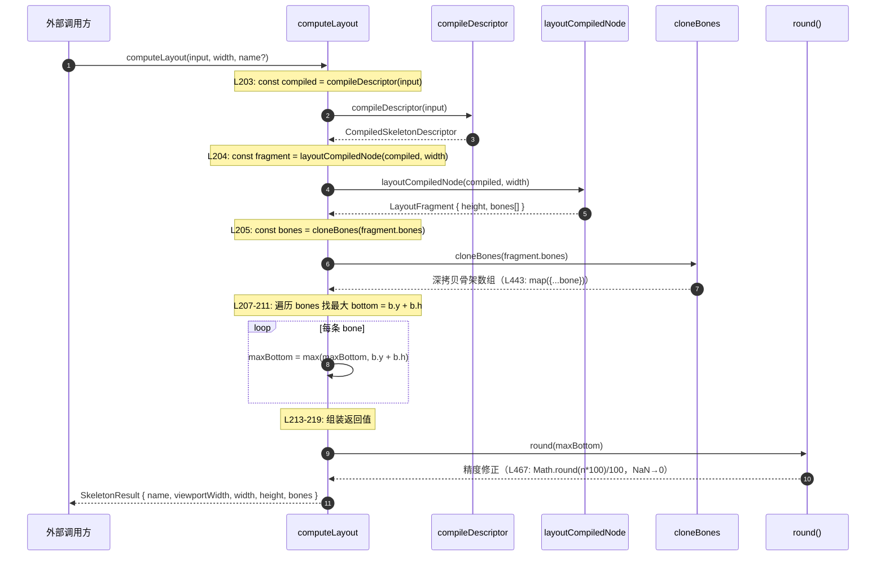
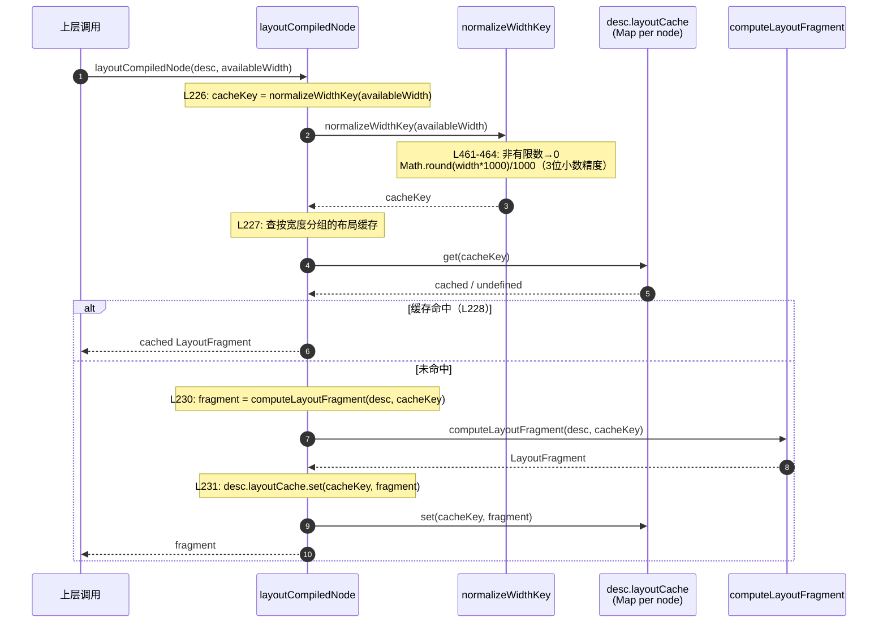
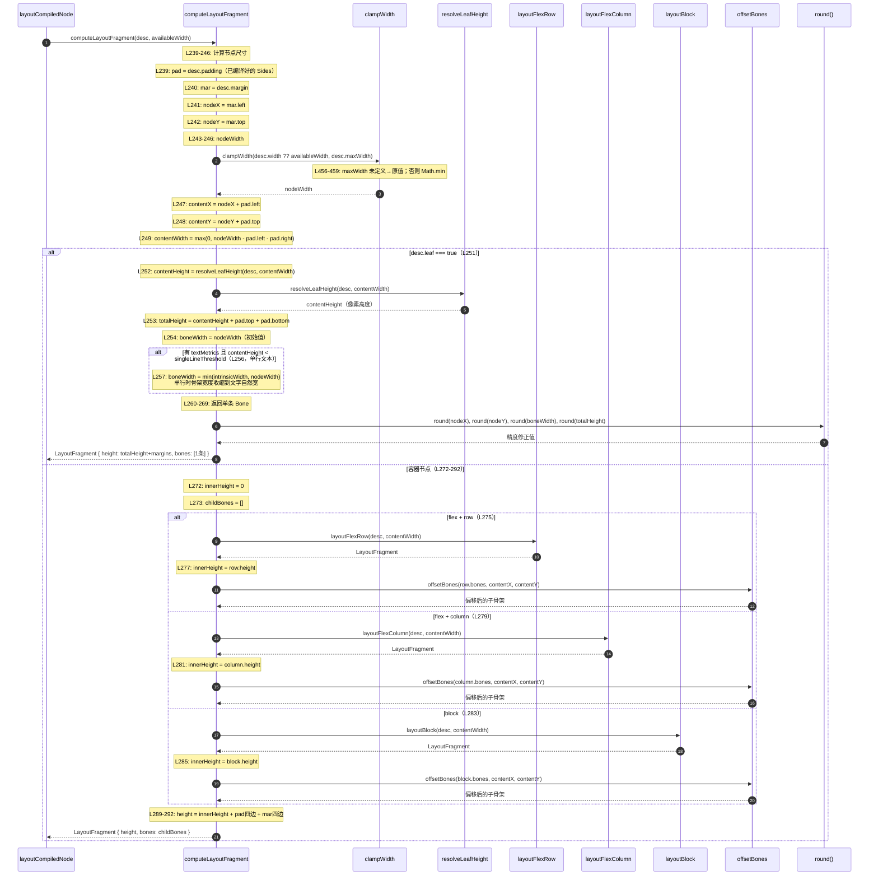
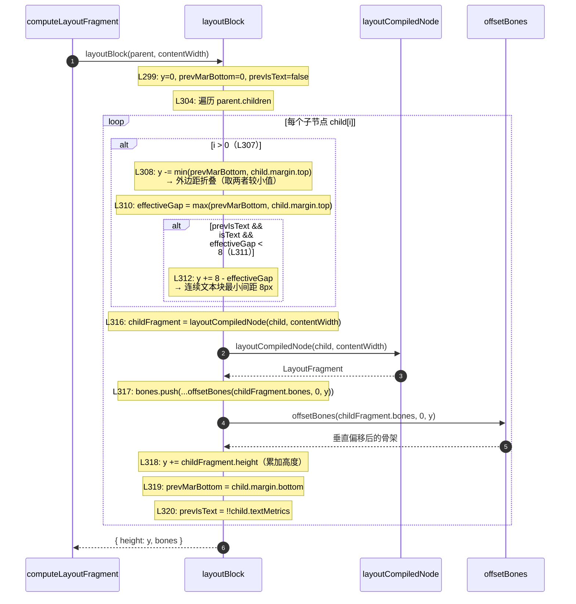
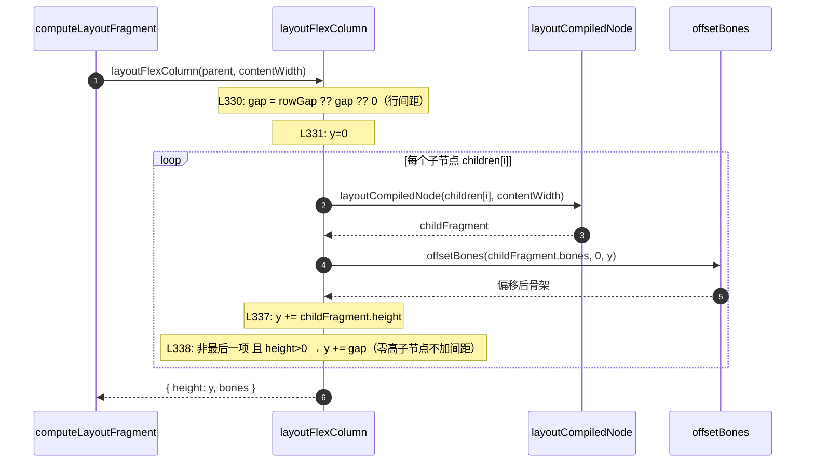
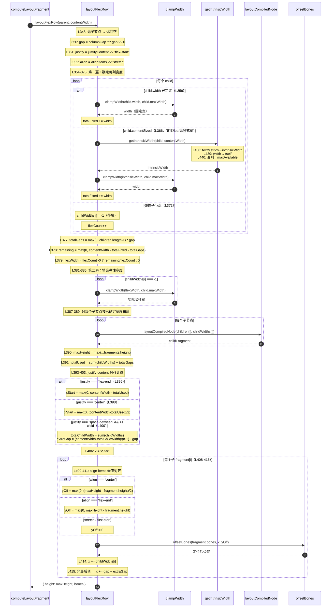
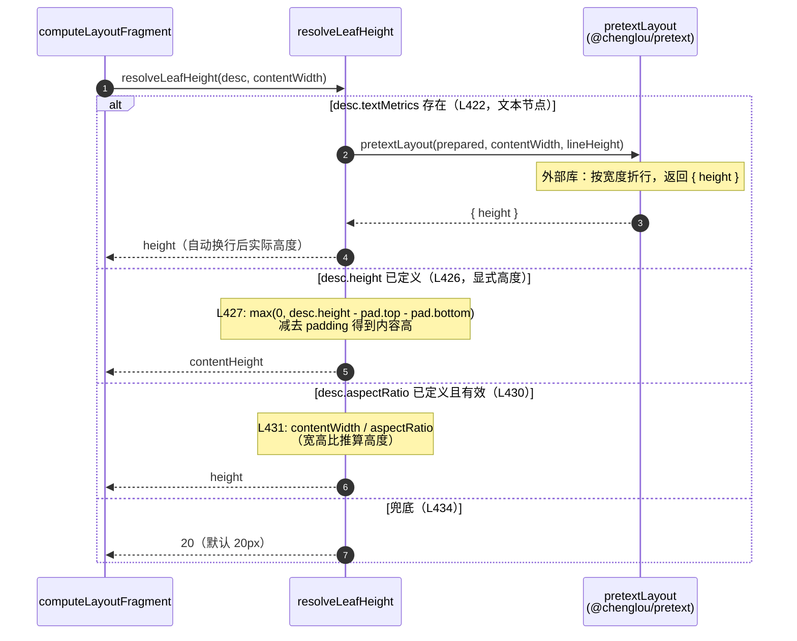

# layout.ts 时序图

> 覆盖每一行代码逻辑，按调用链展开。

---

## 架构概述

```
compileDescriptor()  ← 冷路径：一次性解析、准备文本、建编译树
computeLayout()      ← 热路径：复用编译树，按宽度做算术布局
```

---

## 1. 主入口：`computeLayout`（第 198-220 行）



**L203** — 调用 `compileDescriptor(input)`，将原始 `SkeletonDescriptor` 转换为带缓存的 `CompiledSkeletonDescriptor`。编译是"冷路径"，只做一次；如果传入的本就是编译态对象，则直接复用（或在源数据变更时自动重编译）。

**L204** — 拿到编译树后，调用 `layoutCompiledNode(compiled, width)` 执行真正的布局计算，返回 `LayoutFragment { height, bones[] }`。`bones` 是一组坐标已相对于容器原点定好的骨架矩形。

**L205** — 立即对 `fragment.bones` 做深拷贝（`cloneBones`，内部是 `map({...bone})`），防止调用方持有的引用污染内部缓存数据。

**L207-211** — 遍历拷贝出来的 `bones` 数组，逐条计算 `b.y + b.h`（即每条骨架的下边界），取最大值得到 `maxBottom`。这是整个骨架的实际内容高度，不依赖容器声明高度，而是由实际排布结果决定。

**L213-219** — 组装最终返回值 `SkeletonResult`：将 `maxBottom` 经 `round()`（`Math.round(n*100)/100`，非有限数归零）精度修正后作为 `height`，连同 `name`、`viewportWidth`、`width`、`bones` 一起返回给调用方。

---

## 2. 编译阶段：`compileDescriptor`（第 133-182 行）

```mermaid
sequenceDiagram
    autonumber
    participant CL as computeLayout
    participant CD as compileDescriptor
    participant ICD as isCompiledDescriptor
    participant EFC as ensureFreshCompiled
    participant FP as fingerprintDescriptor
    participant Cache as compiledDescriptorCache<br/>(WeakMap, L55)
    participant RS as resolveSides
    participant IL as isLeaf
    participant PS as prepareWithSegments<br/>(@chenglou/pretext)
    participant GITW as getIntrinsicTextWidth
    participant WLR as walkLineRanges

    CL->>CD: compileDescriptor(input)

    Note over CD: L136: 若 input 已是编译态
    CD->>ICD: isCompiledDescriptor(input)
    Note over ICD: L65-67: 检查 __compiled === true
    ICD-->>CD: true / false

    alt 已是 CompiledSkeletonDescriptor（L136）
        CD->>EFC: ensureFreshCompiled(desc)
        Note over EFC: L123: nextFP = fingerprintDescriptor(desc.source)
        EFC->>FP: fingerprintDescriptor(desc.source)
        FP-->>EFC: 指纹字符串
        Note over EFC: L124: 若指纹未变，直接返回缓存
        alt 指纹相同
            EFC-->>CD: 原 compiled（命中缓存）
        else 指纹变更（源数据被修改）
            EFC->>CD: compileDescriptor(desc.source)（重新编译）
        end
    else 原始 SkeletonDescriptor
        Note over CD: L138-142: 查 WeakMap 缓存
        CD->>Cache: compiledDescriptorCache.get(desc)
        Cache-->>CD: cached / undefined

        alt 有缓存（L139-142）
            CD->>FP: fingerprintDescriptor(desc)
            FP-->>CD: nextFingerprint
            Note over CD: L141: 若指纹未变，返回缓存
            CD-->>CL: cached（命中缓存）
        else 无缓存或指纹变更
            Note over CD: L144: sourceFingerprint = fingerprintDescriptor(desc)
            CD->>FP: fingerprintDescriptor(desc)
            FP-->>CD: sourceFingerprint

            Note over CD: L145: padding = resolveSides(desc.padding)
            CD->>RS: resolveSides(desc.padding)
            Note over RS: L57-61: undefined→全0; number→四边相同; Partial→逐字段
            RS-->>CD: Sides { top, right, bottom, left }

            Note over CD: L146: margin = resolveSides(desc.margin)
            CD->>RS: resolveSides(desc.margin)
            RS-->>CD: Sides

            Note over CD: L147-158: 文本指标（仅 text+font+lineHeight 同时存在时）
            alt desc.text && desc.font && desc.lineHeight（L148）
                CD->>PS: prepareWithSegments(desc.text, desc.font)
                Note over PS: 外部库：分词、段落准备
                PS-->>CD: PreparedTextWithSegments

                CD->>GITW: getIntrinsicTextWidth(prepared)
                Note over GITW: L78-83: walkLineRanges 以极大宽度走一遍，取最宽行 width
                GITW->>WLR: walkLineRanges(prepared, MAX_SAFE_INTEGER, cb)
                WLR-->>GITW: 回调每行，收集 line.width
                GITW-->>CD: intrinsicWidth（不含 padding）

                Note over CD: L152-155: 拼 textMetrics<br/>intrinsicWidth += padding.left+right<br/>singleLineThreshold = lineHeight * 1.5
                CD-->>CD: textMetrics 就绪
            else
                CD-->>CD: textMetrics = undefined
            end

            Note over CD: L160-178: 构造 CompiledSkeletonDescriptor
            CD->>IL: isLeaf(desc)
            Note over IL: L70: desc.leaf===true<br/>L71: desc.text!==undefined<br/>L72: 有height且无children<br/>L73: 有aspectRatio且无children
            IL-->>CD: boolean

            Note over CD: L174: contentSized = width===undefined && (有textMetrics || leaf===true)

            Note over CD: L175: 递归编译所有子节点
            loop 每个 child in desc.children
                CD->>CD: compileDescriptor(child)（递归）
            end

            Note over CD: L177: layoutCache = new Map()（每个节点独立缓存）

            Note over CD: L180: compiledDescriptorCache.set(desc, compiled)
            CD->>Cache: set(desc, compiled)

            CD-->>CL: CompiledSkeletonDescriptor
        end
    end
```

---

## 3. 布局缓存层：`layoutCompiledNode`（第 222-233 行）



---

## 4. 核心布局：`computeLayoutFragment`（第 235-293 行）



---

## 5. 三种布局算法

### 5a. Block 布局（第 295-324 行）



### 5b. Flex Column 布局（第 326-342 行）



### 5c. Flex Row 布局（第 344-419 行）



---

## 6. 叶节点高度：`resolveLeafHeight`（第 421-435 行）



---

## 7. 工具函数说明

| 函数 | 位置 | 作用 |
|------|------|------|
| `resolveSides(v)` | L57-61 | `undefined`→全0；`number`→四边等值；`Partial<Sides>`→补0 |
| `isLeaf(desc)` | L69-75 | 4种判定：显式`leaf:true`、有`text`、有`height`无子、有`aspectRatio`无子 |
| `getIntrinsicTextWidth(prepared)` | L77-83 | 以无限宽跑一遍文本布局，取最宽行宽度 |
| `fingerprintValue(v)` | L90-93 | `undefined`→`''`；其他→`String(v)` |
| `fingerprintSides(v)` | L85-88 | 调用`resolveSides`后拼成`"t,r,b,l"` |
| `fingerprintDescriptor(desc)` | L95-118 | 将所有字段拼为`::`分隔字符串，子节点递归；用于检测源数据变更 |
| `getIntrinsicWidth(desc, max)` | L437-441 | textMetrics→intrinsicWidth；有width→width；否则→maxAvailable |
| `cloneBones(bones)` | L443-445 | `map({...bone})`浅拷贝，防外部修改 |
| `offsetBones(bones, dx, dy)` | L447-454 | dx/dy全0时直接cloneBones；否则加偏移量并round |
| `clampWidth(w, max)` | L456-459 | `max`未定义→原值；否则`Math.min(w, max)` |
| `normalizeWidthKey(w)` | L461-464 | 非有限数→0；`Math.round(w*1000)/1000`（3位精度，防浮点key碎片化） |
| `round(n)` | L466-469 | 非有限数→0；`Math.round(n*100)/100`（2位精度，骨架坐标） |

---

## 8. 数据流总览

```
外部调用
  │
  ▼
computeLayout(input, width, name)
  │
  ├─→ compileDescriptor(input)           ← WeakMap 缓存，指纹变化时重编译
  │     ├─ resolveSides(padding/margin)
  │     ├─ prepareWithSegments(text,font) ← 仅文本节点
  │     ├─ getIntrinsicTextWidth()        ← 仅文本节点
  │     ├─ isLeaf()
  │     └─ 递归编译子节点
  │
  ├─→ layoutCompiledNode(compiled, width) ← Map<width, fragment> 缓存
  │     └─ computeLayoutFragment()
  │           ├─ [leaf]   resolveLeafHeight() → 单条 Bone
  │           ├─ [flex-row]    layoutFlexRow()
  │           ├─ [flex-column] layoutFlexColumn()
  │           └─ [block]       layoutBlock()
  │                 └─ 递归 layoutCompiledNode(children)
  │                      └─ offsetBones(dx, dy)
  │
  ├─→ cloneBones()                        ← 防外部修改
  └─→ 计算 maxBottom → SkeletonResult
```

---

## 9. 缓存策略说明

```
compiledDescriptorCache (WeakMap, 模块级)
  key:   原始 SkeletonDescriptor 对象
  value: CompiledSkeletonDescriptor
  失效:  fingerprintDescriptor() 结果变化 → 重编译
         invalidateDescriptor() 显式清除

desc.layoutCache (Map, 每个编译节点独立)
  key:   normalizeWidthKey(availableWidth)  ← 3位精度整数
  value: LayoutFragment { height, bones[] }
  失效:  重新编译节点时 new Map()
```
