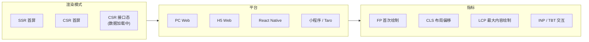
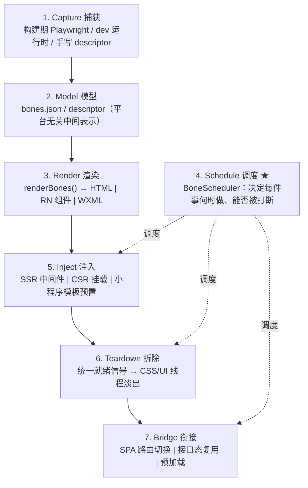
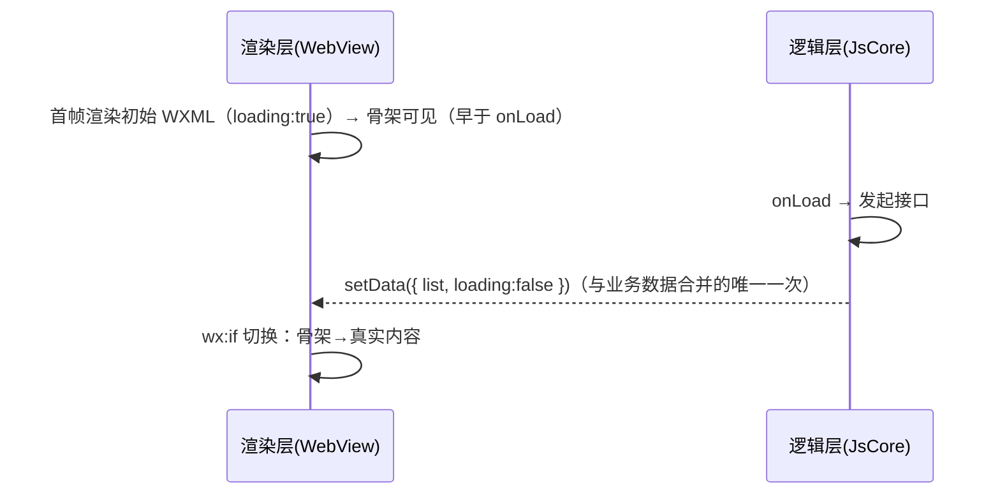

# Smarty Skeleton 通用骨架架构设计

> 跨渲染模式（SSR / CSR / 接口态）× 跨平台（PC Web / H5 / React Native / 微信小程序·Taro）的骨架屏系统，
> 内置一个仿 React Scheduler 的非阻塞调度器。
>
> 本文是架构总纲；其中"Web SSR 注入"一章是 [ssr-injection-design.md](./ssr-injection-design.md) 的上位整合，后者作为该章的实现细节附录保留。
> 构建期自动生成 / dev:ske 工作流 / 断点自动扫描 / 接口态 HOC / CI 同步校验 等工具链细节，见 [skeleton-build-pipeline-design.md](./skeleton-build-pipeline-design.md)。
>
> 复用基座：`renderBones()`（[runtime.ts](./runtime.ts)）、`resolveResponsive()` / 颜色与动画常量（[shared.ts](./shared.ts)）、`computeLayout()`（[layout.ts](./layout.ts)）。

---

## 0. 设计哲学：骨架是"障眼法"

骨架屏没有任何业务价值，它唯一的作用是**在真实内容到达前，用一个低成本的视觉占位骗过用户的等待感知**。
这条认知推导出整套架构的三条铁律，违反任意一条都不允许合入：


| 铁律               | 含义              | 工程后果                                                                       |
| ---------------- | --------------- | -------------------------------------------------------------------------- |
| **铁律一 · 零阻塞**    | 障眼法绝不能和"真东西"抢资源 | 骨架的捕获 / 渲染 / 预加载 / 拆除，全部走可中断、可让出的调度器；绝不进入关键渲染路径，绝不拖慢 hydration、不污染 INP/TBT |
| **铁律二 · 零跨团队耦合** | 骨架是前端的私有实现      | 服务端只装一次中间件；RN/小程序只在模板里放一个占位节点；业务代码零侵入                                      |
| **铁律三 · 可证伪降级**  | 障眼法失败必须无感       | 任何环节出错（无中间件 / Observer 不触发 / 平台不支持）都退回"无骨架但功能完整"，绝不白屏、绝不卡死、绝不遮挡真实内容        |


铁律一是本次重构的核心，也是它区别于市面所有骨架方案（含 smarty-skeleton）的地方：
**大多数方案把骨架当"组件"渲染，于是骨架本身的渲染/动画/拆除都在主线程同步发生**——在低端机或 hydration 高峰期，障眼法自己成了卡顿源。本设计把骨架的一切非视觉工作下沉到独立调度器，按优先级让出主线程。

---

## 1. 问题域

### 1.1 三维矩阵

骨架要解决的不是一个场景，而是「渲染模式 × 平台 × 指标」的笛卡尔积。先把空间画清楚，避免设计时漏面。




### 1.2 模式 × 平台 可行性矩阵


|             | PC Web             | H5 Web             | React Native | 小程序 / Taro                  |
| ----------- | ------------------ | ------------------ | ------------ | --------------------------- |
| **SSR 首屏**  | ✅ 中间件注入 HTML       | ✅ 中间件注入 HTML       | ❌ 无 HTML 文档  | ⚠️ 无传统 SSR，等价物=「首屏 WXML 预置」 |
| **CSR 首屏**  | ✅ 运行时 `<Skeleton>` | ✅ 运行时 `<Skeleton>` | ✅ 组件树占位      | ✅ 自定义组件占位                   |
| **CSR 接口态** | ✅ 数据加载骨架           | ✅ 数据加载骨架           | ✅ 数据加载骨架     | ✅ 数据加载骨架                    |


> 三个"等价物"是本设计的关键洞察：**不同平台没有统一的"首屏"原语，但都有统一的"占位 → 就绪信号 → 拆除"生命周期**。我们把这个生命周期抽象出来（§7 Teardown 信号），再为每个平台提供后端实现。

### 1.3 性能指标：障眼法到底能动哪个？（结论先行，详见 §6）

这是整套设计最容易被人云亦云的地方。诚实结论：


| 指标                              | 骨架的真实影响              | 原因                                                                                             |
| ------------------------------- | -------------------- | ---------------------------------------------------------------------------------------------- |
| **FP（First Paint）**             | ✅ **显著前移**           | FP 统计任意像素绘制，含背景色块；骨架就是第一屏背景色块                                                                  |
| **FCP（First Contentful Paint）** | ⚠️ **取决于实现**         | 纯 `background-color` 空 div 通常不算 contentful；shimmer 用 `background-image: linear-gradient` 才可能计入 |
| **LCP**                         | ⛔ **设计为中性（不改善、不回退）** | 纯色 / 背景图块**不是 LCP 候选**（LCP 只认 ``、`<video>`海报、含 `url()` 背景图、块级文本）；骨架天然不污染 LCP，真实 LCP 由内容决定 |
| **CLS**                         | ✅ **改善**             | `position:fixed` 覆盖层不占流；`:empty{min-height}` 锚定 `#root` 防回弹                                    |
| **INP / TBT**                   | ✅ **被保护（不回退）**       | 骨架所有 JS 工作经调度器分片让出，不制造长任务                                                                      |
| **Speed Index / 感知速度**          | ✅ **显著改善**           | 这才是骨架的主战场                                                                                      |


**一句话定位：骨架优化的是「FP + CLS + 感知速度」，对 LCP/INP 的承诺是「不回退」。** 把骨架吹成"提升 LCP"是不专业的——这正是 §6 要展开的深度。

---

## 2. 总体架构：七层流水线

把骨架生命周期拆成七层，每层单一职责、可跨平台替换实现：




- 第 1–3 层（捕获/模型/渲染）已在现有 boneyard 中存在，本设计**不改**，只新增多平台 Render 后端。
- 第 4 层（调度）是**全新核心**，是铁律一的载体。
- 第 5–7 层按平台分别实现，但都**通过调度器编排**。

---

## 3. 核心：BoneScheduler —— 仿 React Scheduler 的非阻塞调度器

> 这一章是整份设计的灵魂。骨架是障眼法，**所以它的代码必须比业务代码更"懂得退让"**。
> React 之所以能在渲染巨树时不卡顿，靠的是 Scheduler 包的"可中断 + 时间分片 + 优先级过期"。我们把同一套机制，用在"障眼法"的所有副作用上。

### 3.1 为什么骨架需要一个调度器（动机）

不用调度器的"组件式骨架"会在三个时刻偷走主线程：

1. **首屏 hydration 高峰**：React 正在 hydrate 真实树，而骨架的 MutationObserver 回调、SPA 预加载 fetch、解析 snippet 的 `innerHTML` 同时挤进来 → 长任务，**INP / TBT 恶化**，hydration 被推迟（讽刺的是骨架反而让"变成真东西"更慢）。
2. **路由切换**：连续快速导航时，逐个同步注入/拆除上一个 overlay → 掉帧。
3. **多断点 / 多路由预加载**：把所有路由的 snippet 提前 fetch+parse 进内存，若同步做，直接抢占首屏交互。

调度器的目标：**把上述工作全部变成"有优先级、能被高优先级打断、能在空闲时推进、且永不饿死"的任务。**

### 3.2 优先级模型（lane / expiration）

照搬 React Scheduler 的五档优先级与"过期时间"思想——优先级不是绝对的，而是通过 `expirationTime = startTime + timeout` 转成一个会随时间逼近的 deadline，越接近越优先，从而**防止低优先级任务被永久饿死**。

```ts
// scheduler/priorities.ts
export const enum BonePriority {
  Immediate = 1,    // 拆除真实内容已就绪的骨架：必须尽快，避免"内容已出、骨架还盖着"
  UserVisible = 2,  // 当前路由骨架的注入/淡出：用户正在看
  Normal = 3,       // 当前可视区之外的骨架处理
  Low = 4,          // SPA 下一跳的 snippet 预加载
  Idle = 5,         // 全量路由预热、devtools 采样、埋点上报
}

// 与 React 完全一致的 timeout 映射（单位 ms）
const TIMEOUTS: Record<BonePriority, number> = {
  [BonePriority.Immediate]: -1,            // 立即过期 → 永远排在最前
  [BonePriority.UserVisible]: 250,
  [BonePriority.Normal]: 5000,
  [BonePriority.Low]: 10000,
  [BonePriority.Idle]: 1073741823,         // maxSigned31BitInt → 只在真正空闲时做
}
```

任务类型到优先级的固定映射（这是经验，不开放给业务乱配）：


| 任务                     | 优先级           | 理由                             |
| ---------------------- | ------------- | ------------------------------ |
| 真实内容就绪 → 拆除骨架          | `Immediate`   | 障眼法的天职是"真东西来了立刻让位"，晚一帧都可能露馅或闪烁 |
| 当前路由骨架注入 / fade-out 驱动 | `UserVisible` | 用户正盯着这块                        |
| 接口态骨架（视区内）             | `UserVisible` | 同上                             |
| 接口态骨架（视区外，懒加载列表）       | `Normal`      | 可稍后                            |
| 下一跳路由 snippet 预加载      | `Low`         | 预测性工作，可被任何真实交互打断               |
| 全量路由预热 / 采样 / 上报       | `Idle`        | 纯锦上添花                          |


### 3.3 时间分片与让出（shouldYield）

核心不变量：**任何一段骨架 JS 连续执行不超过一个帧预算（默认 5ms），到点立刻让出主线程**，下一个宏任务再继续。这正是 React `workLoopConcurrent` 里 `shouldYield()` 的语义。

```ts
// scheduler/yield.ts
const FRAME_INTERVAL = 5 // ms，与 React frameInterval 默认值一致
let deadline = 0

export function shouldYield(): boolean {
  const now = getCurrentTime()
  if (now >= deadline) return true
  // 有真实输入待处理（用户点击/输入）时，骨架立刻让路——铁律一
  const nav = navigator as Navigator & { scheduling?: { isInputPending?: () => boolean } }
  if (nav.scheduling?.isInputPending?.()) return true
  return false
}

export function resetDeadline(): void {
  deadline = getCurrentTime() + FRAME_INTERVAL
}
```

`isInputPending`（Facebook 贡献给 Chromium 的 API）是点睛之笔：即使帧预算没用完，只要有用户输入排队，障眼法立即停手——把主线程还给真正重要的交互。

### 3.4 宏任务驱动：MessageChannel（而非 setTimeout）

`setTimeout(fn, 0)` 有 4ms 钳制，嵌套后掉到 ~4ms/次，调度精度差。React Scheduler 用 `MessageChannel` 触发一个"尽快执行的宏任务"，我们照做；并做跨平台降级。

```ts
// scheduler/host.ts —— 宿主层：唯一与平台耦合的地方
let scheduledHostCallback: ((hasMore: boolean) => boolean) | null = null

function postTask(): void { /* 由具体后端实现，见 §3.7 */ }

export function requestHostCallback(cb: () => boolean): void {
  scheduledHostCallback = cb
  schedulePerformWork()
}

// Web 后端：MessageChannel
const channel = typeof MessageChannel !== 'undefined' ? new MessageChannel() : null
if (channel) {
  channel.port1.onmessage = performWorkUntilDeadline
}
function schedulePerformWork(): void {
  if (channel) channel.port2.postMessage(null)
  else setTimeout(performWorkUntilDeadline, 0) // 降级
}

function performWorkUntilDeadline(): void {
  if (!scheduledHostCallback) return
  resetDeadline()
  let hasMore = false
  try {
    hasMore = scheduledHostCallback()      // 在一个帧预算内尽量推进
  } finally {
    if (hasMore) schedulePerformWork()     // 还有活 → 下一个宏任务继续（让出后再来）
    else scheduledHostCallback = null
  }
}
```

### 3.5 任务队列：最小堆（min-heap）

按 `(sortIndex=expirationTime, id)` 排序的二叉最小堆，`peek/pop` O(1)/O(log n)，与 React `SchedulerMinHeap` 同构。延时任务进 timerQueue，到点迁移到 taskQueue。

```ts
// scheduler/heap.ts （节选，结构同 React SchedulerMinHeap）
export type Task = {
  id: number
  callback: ((didTimeout: boolean) => unknown) | null
  priority: BonePriority
  startTime: number
  expirationTime: number
  sortIndex: number
}

export function push(h: Task[], t: Task) { h.push(t); siftUp(h, t, h.length - 1) }
export function peek(h: Task[]) { return h.length ? h[0] : null }
export function pop(h: Task[]) {
  if (!h.length) return null
  const first = h[0], last = h.pop()!
  if (last !== first) { h[0] = last; siftDown(h, last, 0) }
  return first
}
function siftUp(h: Task[], n: Task, i: number) {
  while (i > 0) {
    const p = (i - 1) >>> 1
    if (compare(h[p], n) > 0) { h[i] = h[p]; i = p } else break
  }
  h[i] = n
}
function siftDown(h: Task[], n: Task, i: number) {
  const len = h.length, half = len >>> 1
  while (i < half) {
    let l = i * 2 + 1; const r = l + 1; let best = l
    if (r < len && compare(h[r], h[l]) < 0) best = r
    if (compare(h[best], n) < 0) { h[i] = h[best]; i = best } else break
  }
  h[i] = n
}
const compare = (a: Task, b: Task) => a.sortIndex - b.sortIndex || a.id - b.id
```

### 3.6 调度主循环

```ts
// scheduler/index.ts
let taskQueue: Task[] = []
let timerQueue: Task[] = []
let taskIdCounter = 1
let isPerformingWork = false

export function scheduleCallback(
  priority: BonePriority,
  callback: Task['callback'],
  options?: { delay?: number },
): Task {
  const now = getCurrentTime()
  const startTime = now + (options?.delay ?? 0)
  const timeout = TIMEOUTS[priority]
  const task: Task = {
    id: taskIdCounter++, callback, priority, startTime,
    expirationTime: startTime + timeout, sortIndex: -1,
  }
  if (startTime > now) {           // 延时任务
    task.sortIndex = startTime
    push(timerQueue, task)
  } else {                         // 立即任务
    task.sortIndex = task.expirationTime
    push(taskQueue, task)
    requestHostCallback(flushWork)
  }
  return task
}

export function cancelCallback(task: Task): void { task.callback = null } // 惰性删除

function flushWork(): boolean {
  isPerformingWork = true
  try {
    return workLoop(getCurrentTime())
  } finally {
    isPerformingWork = false
  }
}

function workLoop(initialTime: number): boolean {
  let currentTime = initialTime
  advanceTimers(currentTime)
  let task = peek(taskQueue)
  while (task) {
    // 未过期且应让出 → 暂停，把主线程交还（铁律一）
    if (task.expirationTime > currentTime && shouldYield()) break
    const cb = task.callback
    if (typeof cb === 'function') {
      task.callback = null
      const didTimeout = task.expirationTime <= currentTime
      const cont = cb(didTimeout)              // 任务可返回"续作"函数 → 自身可分片
      currentTime = getCurrentTime()
      if (typeof cont === 'function') {
        task.callback = cont                   // 没做完，保留在队首下次继续
      } else if (task === peek(taskQueue)) {
        pop(taskQueue)
      }
      advanceTimers(currentTime)
    } else {
      pop(taskQueue)                           // 已取消
    }
    task = peek(taskQueue)
  }
  if (task) return true                        // 还有任务 → 让宿主再排一个宏任务
  const next = peek(timerQueue)
  if (next) requestHostTimeout(() => {         // 没有立即任务，但有延时任务 → 定时唤醒
    advanceTimers(getCurrentTime())
    if (peek(taskQueue)) requestHostCallback(flushWork)
  }, next.startTime - currentTime)
  return false
}

function advanceTimers(now: number) {
  let t = peek(timerQueue)
  while (t) {
    if (t.callback === null) pop(timerQueue)
    else if (t.startTime <= now) { pop(timerQueue); t.sortIndex = t.expirationTime; push(taskQueue, t) }
    else break
    t = peek(timerQueue)
  }
}
```

### 3.7 跨平台调度后端（host 抽象）

铁律一要在所有平台成立，但每个平台的"尽快执行的宏任务/空闲时机"原语不同。只把 `host.ts` 这一层换实现：


| 平台               | "尽快宏任务"（`schedulePerformWork`）       | "空闲时机"（Idle 优先级）                                    | "让出依据"（`shouldYield`）              |
| ---------------- | ------------------------------------ | --------------------------------------------------- | ---------------------------------- |
| **PC / H5 Web**  | `MessageChannel.postMessage`         | `requestIdleCallback`（带 polyfill）                   | 帧预算 5ms + `isInputPending`         |
| **React Native** | `setImmediate` / `queueMicrotask` 组合 | `InteractionManager.runAfterInteractions`（等手势/动画结束） | 帧预算 + `InteractionManager` 是否有活跃交互 |
| **小程序 / Taro**   | `wx.nextTick`（逻辑层微任务）                | 双线程空闲：`setData` 回调链 + 定时兜底                          | 帧预算 + 是否有 pending `setData`        |


```ts
// scheduler/host.native.ts （RN 后端示例）
import { InteractionManager } from 'react-native'
export function schedulePerformWork() { setImmediate(performWorkUntilDeadline) }
export function scheduleIdle(cb: () => void) { InteractionManager.runAfterInteractions(cb) }
// shouldYield 额外条件：InteractionManager 当前有句柄时直接让出，绝不和手势动画抢 JS 线程
```

```ts
// scheduler/host.mp.ts （小程序 / Taro 后端示例）
declare const wx: { nextTick: (cb: () => void) => void }
export function schedulePerformWork() {
  if (typeof wx !== 'undefined' && wx.nextTick) wx.nextTick(performWorkUntilDeadline)
  else setTimeout(performWorkUntilDeadline, 0)
}
```

### 3.8 与 React 并发渲染协作（最关键的"不抢"）

光有自己的调度器还不够——还要保证它**和 React 自己的调度器井水不犯河水**：

- **拆除时机用 microtask 紧贴 commit**：拆除骨架属于 `Immediate`，但它的"触发"应挂在真实内容 commit 之后。Web 上由 `MutationObserver` 回调触发（已是 microtask 时序）；React 内集成时可用 `useInsertionEffect`/`useLayoutEffect` 在 commit 阶段 enqueue 一个 `Immediate` 任务。
- **预加载严格 `Low`/`Idle`**：snippet 预热永远不和 hydration 抢。hydration 期间 `isInputPending` 与高频 `MessageChannel` 回合会让 `shouldYield` 频繁返回 true，预加载被自然推迟到首屏交互稳定后。
- **绝不在调度任务里做布局抖动**：所有任务只做"准备数据 / 解析字符串 / DOM 片段构建"，真正的 DOM 插入与移除是一次性、批量、且尽量交给 compositor（CSS 动画）——见 §5/§6。
- **防饥饿**：`expirationTime` 保证即使一直有高优先级任务，低优先级任务过期后 `didTimeout=true` 也会被强制执行（例如预加载最迟 10s、Idle 任务有上限）。

> 设计自检：如果有人问"你这调度器会不会自己变成卡顿源？"——不会。单个任务受 5ms 帧预算约束并可让出；队列是惰性删除的最小堆；宿主回合由 MessageChannel 串行驱动，不会并发膨胀。**最坏情况退化为"骨架晚一点出现/晚一点预热"，而这恰恰符合障眼法的优先级——障眼法可以迟到，真实内容不能。**

---

## 4. 渲染模式

### 4.1 SSR 首屏（PC / H5 Web）

构建期由 `snippet.ts/renderSnippet()` 生成自包含 snippet（`renderBones()` 输出 + 覆盖层 + teardown CSS + IIFE），服务端 `@boneyard/middleware` 用 **Transform Stream 逐块扫描 `</body>`** 注入（支持 React 18 流式 / Next App Router），中间件须置于压缩之前并移除 `Content-Length`。

> 完整的 manifest / 中间件 / bridge / 多视口 / CLS 锚定 / 章节级决议，见附录文档 [ssr-injection-design.md](./ssr-injection-design.md)。本章只强调它如何接入七层流水线与调度器：
>
> - 首屏骨架在 HTML 内，**零 JS 即可见**（FP 前移的来源）。
> - snippet 内联的首屏核心 IIFE 只做"注册就绪监听 + 兜底超时"，属调度器的 `Immediate`/`UserVisible`；**不在首屏做任何预加载**。
> - SPA bridge 的预加载走 `Low`/`Idle`，由 §3 调度器编排。

### 4.2 CSR 首屏（全平台）

无服务端注入时，运行时 `<Skeleton>` 在挂载瞬间渲染骨架。关键：**骨架的首帧渲染要尽量轻**——直接用预编译的 `bones.json`（构建期产物）而非运行时测量 DOM，避免在最忙的首屏做 `getBoundingClientRect` 引发强制重排。

```tsx
// 伪代码：CSR 首屏骨架，初始 bones 由构建期注入（见 ssr 文档 §十三 SWC 插件）
<Skeleton name="home" initialBones={__BONES_home} loading={!hydrated}>
  <HomePage />
</Skeleton>
```

### 4.3 CSR 接口态（数据加载骨架）——独立且最高频的场景

用户列的"CSR 接口场景"是日常最常见的：首屏 HTML/壳已就绪，但**列表/详情在等接口**。这与"首屏骨架"是不同的生命周期，必须单独设计：

- **触发**：数据请求 `pending` → 显示骨架；`success/error` → 拆除。
- **就绪信号**：不再是 DOM mutation，而是**数据状态**（见 §7 统一信号）。直接订阅 Suspense / SWR / React Query 的状态，比观察 DOM 更准、更早。
- **防闪烁（关键）**：接口很快返回（<200ms）时骨架一闪而过反而更糟。引入**最小展示时长 + 延迟出现**双阈值（同 `smarty-skeleton` 的体验经验）：
  - `delay`（默认 120ms）：请求未超过该时长就返回，则**根本不显示**骨架。
  - `minDuration`（默认 300ms）：一旦显示，至少停留这么久，避免"骨架 → 内容"瞬切的撕裂感。
  - 这两个定时器都通过调度器（`UserVisible`，`delay` 走 timerQueue）管理，可被打断/取消。

```tsx
// 接口态骨架与数据层集成（框架无关 hook 形态）
function useSkeleton(state: 'idle' | 'pending' | 'done', name: string) {
  const [visible, setVisible] = useState(false)
  useEffect(() => {
    if (state !== 'pending') return
    const showTask = scheduleCallback(BonePriority.UserVisible,
      () => setVisible(true), { delay: 120 })          // delay 阈值
    return () => cancelCallback(showTask)
  }, [state])
  useEffect(() => {
    if (state === 'done' && visible) {
      const t = scheduleCallback(BonePriority.Immediate, () => setVisible(false))
      return () => cancelCallback(t)                    // minDuration 由调度器配合时间戳判断
    }
  }, [state, visible])
  return visible
}
```

- **与 Suspense 配合**：把骨架作为 `<Suspense fallback>`，但 fallback 内部仍走调度器控制的 delay/minDuration，解决 Suspense 原生没有"防闪烁"的痛点。

---

## 5. 平台适配

### 5.1 PC / H5 Web

- **渲染后端**：`renderBones()` → HTML 字符串。H5 与 PC 共用，差异仅在注入断点（`defaultBreakpoint`：H5=375，PC=1280）。
- **动画后端**：shimmer/pulse 用 **CSS `@keyframes`**，运行在合成器线程（compositor），**不占主线程**——这是 Web 上落实铁律一的关键：障眼法的动画天然零 JS 成本。
- **拆除后端**：`MutationObserver(childList+subtree)` + 元素节点判定 + `MAX_WAIT` 兜底；淡出用 CSS `animation forwards`（合成器驱动），JS 只加一个 class。
- **H5 额外**：iOS Safari 的 `100vh` 抖动 → 覆盖层用 `inset:0 + position:fixed` 配合 `dvh` 回退；低端安卓优先 `pulse`（透明度动画，比 shimmer 的渐变位移更省）。

### 5.2 React Native

RN 没有 DOM、没有 HTML、没有 SSR，但七层流水线照样成立：

- **渲染后端**：bones → RN 组件树（`<View>` + 背景色），复用 `react-native.tsx`。
- **动画后端（铁律一的 RN 版）**：**必须用 Reanimated 2/3 的 worklet，让 shimmer 跑在 UI 线程**，而不是 `Animated` + JS 驱动。否则首屏 JS 线程繁忙时骨架动画会掉帧——障眼法又一次自己露馅。
- **拆除后端**：没有 mutation 可观察，用**数据/交互信号**：
  - 首屏：`InteractionManager.runAfterInteractions` 等导航转场动画结束，再在数据就绪时拆除。
  - 接口态：直接订阅请求状态（§4.3）。
- **调度后端**：`host.native.ts`（`setImmediate` + `InteractionManager`），见 §3.7。骨架预热/采样全部 `runAfterInteractions`，绝不和手势/转场抢 JS 线程。
- **指标差异**：RN 无 FP/LCP/CLS（那是 Web 指标）。对应目标变成 **TTI 感知 / JS 线程帧率（不掉帧）/ 首个可交互时刻**。所以在 RN 上，"骨架不掉帧"本身就是 KPI，调度器价值更直接。

### 5.3 微信小程序 / Taro

小程序的**双线程模型**（渲染层 WebView + 逻辑层 JsCore，两者通过 `setData` 跨线程通信）让骨架既有独特优势也有独特约束：

- **优势**：渲染层可以**在逻辑层 ready 之前**就把首屏 WXML 画出来。于是把骨架作为**页面初始 WXML 的一部分（自定义组件 `<bone-skeleton>`）**，配合页面 `data` 的初始值 `loading:true`，**首帧（逻辑层 `onLoad` 尚未 `setData` 时）就能显示骨架**——这是小程序版的"SSR 等价物"。
- **约束**：
  - 没有 `MutationObserver`、没有 `requestIdleCallback`、`setData` 是跨线程且有体积/频率成本。
  - 因此拆除信号只能是**逻辑层数据就绪 → 一次 `setData({loading:false})`**。务必把骨架 DOM 与真实内容用 `wx:if` 切换，且**合并到业务首个 `setData` 里**，避免额外跨线程往返。
- **构建期注入（铁律二）**：用 Taro 插件 / 小程序自定义组件，在编译期把 `<bone-skeleton name="...">` 注入页面模板，业务只写一个标签。Taro 还能把同一份 bones 模型同时编译到 H5 / RN / 小程序三端。
- **调度后端**：`host.mp.ts`（`wx.nextTick`）。Idle 类工作（预热下一页骨架）放到 `wx.nextTick` + 空闲定时兜底，绝不和首屏 `setData` 抢逻辑线程。
- **动画**：优先 CSS 动画（渲染层 WebView 支持），避免用 `setData` 驱动帧动画（跨线程帧动画是小程序性能杀手）。




---

## 6. 指标工程学（深度）

把 §1.3 的结论展开成可论证、可测量的工程依据。这是判断"是不是真懂"的分水岭。

### 6.1 为什么骨架能动 FP 却未必动 FCP

- **FP（First Paint）**：浏览器**首次绘制任何非背景默认值的像素**即记为 FP。骨架的灰色块就是像素变化，所以**SSR 注入的骨架几乎等于把 FP 拉到 HTML 首个渲染帧**。
- **FCP（First Contentful Paint）**：要求绘制的是 *contentful* 内容——文本、图片、SVG、非白 canvas、**含 `url()` 的背景图**。**纯 `background-color` 的空 div 不算 contentful**。
  - 推论：若骨架只用纯色块，FCP 不一定前移；若 shimmer 用 `background-image: linear-gradient(...)`，则该背景图可能触发 FCP。
  - 工程取舍：是否追 FCP，取决于业务用哪个指标考核。本设计默认 `pulse`（纯色透明度动画，省电）→ 主打 FP；可切 `shimmer`（渐变背景图）→ 兼顾 FCP。这个权衡写进 `--preload-anim` 配置。
- **文字骨架用 `linear-gradient` 渲染（借鉴 page-skeleton `text.js`，一举两得）**：
对文本块不画"每行一个色块 div"，而是给元素本身加 `background-image: linear-gradient(transparent x%, color, color y%, transparent)` + `background-size: 100% lineHeight` + `repeat-y`，多行文字一次成型，末行用一个白色遮罩 `<span>` 缩短宽度模拟自然段落。
  - **省**：一个文本块从 N 个 bone 降为 1 个元素 + 1 条 CSS 规则（配合 §9 的 styleCache 去重），snippet 体积显著下降。
  - **动 FCP**：这是 `background-image`（非纯 `background-color`），属于 contentful → **正好补上"纯色块不动 FCP"的短板**。
  - 落地：`renderBones()` 增加 `textMode: 'block' | 'gradient'`，文本类 bone 走 gradient 分支。

### 6.2 为什么骨架对 LCP 是"中性"而非"提升"（最常见的吹牛点）

- LCP 候选元素**仅限**：``、`<image>`（SVG 内）、`<video>` 的封面、**含 `url()` 背景图的元素**、以及**块级元素里的文本节点**。
- 骨架由"空 div + `background-color`"组成 → **不是 LCP 候选**（纯背景色不算）。
- 因此：
  1. 骨架**不会**成为 LCP 元素，不会污染/提前 LCP（好事）。
  2. 骨架也**不会**改善 LCP——真实 LCP 仍由真实最大内容（通常是主图/大标题）的到达时间决定。
- **陷阱（必须避免）**：如果有人把 shimmer 做成 `background-image`，**且该块面积最大**，它可能短暂成为 LCP 候选，随后被真实内容替换。LCP 取"最大的那次"，可能导致 LCP **读数被骨架带偏**。
  - 规避：骨架块一律 `background-color`（非 `url()`），或给骨架根加 `contain: paint` 与极小化语义；并在 RUM 侧用 `PerformanceObserver` 的 `largest-contentful-paint` entry 的 `element` 字段校验 LCP 元素不是 `#__bp` 子节点。

### 6.3 CLS 改善的两个机制

1. **覆盖层不占流**：`#__bp{position:fixed;inset:0}` → 骨架出现/消失都不推动文档流，自身零 CLS。
2. `**#root` 高度锚定**：React 挂载前 `#root` 高度为 0，内容渲染后撑开 → 回弹 CLS。用 `{{ROOT_SELECTOR}}:empty{min-height:{{ROOT_MIN_H}}px}`（值=注入断点 `max(y+h)`，CLI 推算）撑住，挂载首个子元素后 `:empty` 自动失效。

### 6.4 INP / TBT 由调度器兜底

- 骨架所有 JS（预加载、解析、注入、拆除编排）经 §3 调度器**分片到 ≤5ms 任务**，并在 `isInputPending` 时让出 → 不产生 >50ms 长任务 → 不抬高 TBT、不恶化 INP。
- 反例（不用调度器）：一次性 `fetch` 全量 snippet 并 `innerHTML` 解析十几个路由 → 单个长任务几十 ms，首屏 INP 直接劣化。这正是本设计存在的理由。

### 6.5 测量方法（可复现）

```ts
// scripts/measure-vitals.ts —— Playwright 采 before/after（有/无中间件对照）
// FP/FCP: performance.getEntriesByType('paint')
// LCP:    new PerformanceObserver(...).observe({type:'largest-contentful-paint', buffered:true})
//         记录 entry.element，断言不是骨架节点
// CLS:    layout-shift entries 累加（排除 hadRecentInput）
// TBT:    longtask entries 中 >50ms 部分求和
// 对照组：?boneyard=off 关闭中间件注入，同页同网络节流(Fast 3G/4x CPU)各跑 N 次取中位数
```

> 落地复盘的真实数字见 §10（占位，待填线上灰度数据）。**设计阶段只承诺方法可复现，不编造数字。**

---

## 7. Teardown：统一就绪信号抽象

七层里最容易被各平台写散的就是"什么时候拆"。统一成一个 `ReadySignal` 接口，各平台/各模式提供 source，调度器统一在 `Immediate` 优先级消费：

```ts
// teardown/ready-signal.ts
export interface ReadySignal {
  /** 订阅"真实内容已就绪"，返回取消订阅 */
  subscribe(onReady: () => void): () => void
}

// Web 首屏：DOM mutation
export const domMutationSignal = (root: Element): ReadySignal => ({
  subscribe(onReady) {
    const obs = new MutationObserver(muts => {
      for (const m of muts) for (const n of m.addedNodes)
        if (n.nodeType === 1) { onReady(); return }
    })
    obs.observe(root, { childList: true, subtree: true })
    const timer = setTimeout(onReady, MAX_WAIT)        // 铁律三：兜底
    return () => { obs.disconnect(); clearTimeout(timer) }
  },
})

// 接口态：数据状态
export const dataStateSignal = (subscribe: (cb: () => void) => () => void): ReadySignal => ({ subscribe })

// RN 首屏：交互结束 + 数据
export const interactionSignal = (dataReady: Promise<unknown>): ReadySignal => ({
  subscribe(onReady) {
    let cancelled = false
    InteractionManager.runAfterInteractions(() => dataReady.then(() => { if (!cancelled) onReady() }))
    return () => { cancelled = true }
  },
})

// 小程序：逻辑层数据就绪（由页面 setData 前调用）
export const mpDataSignal = (): ReadySignal & { fire: () => void } => {
  let cb: (() => void) | null = null
  return { subscribe(onReady) { cb = onReady; return () => { cb = null } }, fire() { cb?.() } }
}
```

消费侧统一：

```ts
function attachTeardown(signal: ReadySignal, dismiss: () => void) {
  let done = false
  const unsub = signal.subscribe(() => {
    if (done) return; done = true
    scheduleCallback(BonePriority.Immediate, () => { dismiss(); unsub() })  // 调度器消费
  })
}
```

> 价值：**新增一个平台或一种数据层，只实现一个 `ReadySignal`，调度/拆除/兜底逻辑零改动。** 这就是七层流水线 + 信号抽象带来的可扩展性。

---

## 8. 降级与可观测性

### 8.1 降级矩阵（铁律三）


| 场景                         | 行为                              |
| -------------------------- | ------------------------------- |
| 无 SSR 中间件                  | 退回 CSR 运行时骨架，功能无损               |
| `MutationObserver` 不触发     | `MAX_WAIT` 兜底强制拆除（默认 5s）        |
| 调度器不可用（无 MessageChannel 等） | 降级 `setTimeout`，最坏只是调度精度下降      |
| RN 无 Reanimated            | 降级静态骨架（不动），仍能占位                 |
| 小程序 `setData` 失败           | `wx:if` 默认值保证至少显示骨架，不白屏         |
| 接口 <delay 返回               | 根本不显示骨架，避免闪烁                    |
| 骨架成为 LCP 候选                | RUM 校验 + 构建期 lint 禁止 `url()` 背景 |


### 8.2 可观测性（让障眼法的失败可见）

障眼法最大的风险是"静默失败"——骨架卡住盖在内容上，用户能看见但监控看不见。必须埋点：

```ts
// 通过 Idle 优先级上报，绝不影响性能
scheduleCallback(BonePriority.Idle, () => beacon('boneyard', {
  name, mode, platform,
  shownAt, dismissedAt,
  teardownReason: 'mutation' | 'data' | 'timeout',   // timeout 占比高 = 信号没接对，告警
  maxWaitHit: boolean,                                // 兜底命中率
  lcpPolluted: boolean,                               // RUM 校验 LCP 元素是否被骨架污染
}))
```

关键告警指标：`teardownReason=timeout` 占比、`maxWaitHit` 率、`lcpPolluted` 率。任一升高即说明障眼法在某端"露馅"了。

---

## 9. 竞品对照与本设计的超越点


| 维度      | smarty-skeleton 等现有方案     | 本设计                                                                                                                                     |
| ------- | ------------------------- | --------------------------------------------------------------------------------------------------------------------------------------- |
| 骨架副作用调度 | 同步执行 / 至多 rIC polyfill 单点 | **完整 lane+expiration+时间分片调度器，全副作用统一编排**                                                                                                 |
| 跨平台     | 各端各写一套                    | **七层流水线 + ReadySignal 抽象，平台只换后端**                                                                                                       |
| 接口态防闪烁  | 经验性 setTimeout            | delay/minDuration 双阈值 + 调度器可取消                                                                                                          |
| 指标认知    | 笼统"提升性能"                  | **FP 改善 / LCP 中性 / INP 保护，逐指标可论证可测**                                                                                                    |
| 流式 SSR  | 全量 buffer                 | Transform Stream 逐块扫尾                                                                                                                   |
| 失败可见性   | 无                         | teardown 原因埋点 + LCP 污染 RUM 校验                                                                                                           |
| 响应式/多断点 | 单设备单次生成                   | 多断点自动扫描 + resolveResponsive                                                                                                             |
| 接口态     | 无（仅首屏页面级）                 | API⇄DOM 绑定图 + 区域级渐进揭示                                                                                                                   |
| 借鉴      | —                         | smarty（IIFE 幂等 / CSS-only fade / rIC budget / craPlugin）+ page-skeleton（文字 gradient / CSS 按需裁剪 / 列表归一）+ awesome/dps（`data-`* 逃生钩子），并系统化 |


> **竞品技术借鉴汇总（来自 page-skeleton-webpack-plugin / awesome-skeleton / dps / skeleton-chrome-extension）：**
>
> 1. **文字 `linear-gradient` 渲染**（page-skeleton `text.js`）→ 已纳入 §6.1，省体积 + 动 FCP。
> 2. **CSS 按需裁剪**（page-skeleton 用 `css-tree` 校验 selector 是否命中 DOM，删无用规则）→ 用于 SSR snippet 瘦身，见 [ssr-injection-design.md](./ssr-injection-design.md) §四。
> 3. **开发者逃生钩子**（awesome-skeleton `data-skeleton-remove/ignore/bgcolor/empty`、dps `includeElement/init`）→ 收敛为 `data-bp-`* 规范，见 [skeleton-build-pipeline-design.md](./skeleton-build-pipeline-design.md) §4.3 / G5。
> 4. **列表归一**（page-skeleton `list.js` 克隆首项）→ 印证接口态列表"item 片段 × count"，见 build 文档 §5。
>
> 这些都是上一代"单设备 / 首屏 / 截图式"生成器的微观技巧；它们均无 响应式 / SSR 流式 / 接口态绑定 / 调度器 / 三端 / CI 校验——本设计在架构层代际领先，在微观层吸收其精华。

---

## 10. 落地复盘（线上结果）

> 本节填写真实灰度数据。结构先就位，数字由线上 RUM / 实验平台导出后填入；**未验证不编造**。


| 指标                  | 对照组（无骨架） | 实验组（骨架） | 变化          | 平台/模式  |
| ------------------- | -------- | ------- | ----------- | ------ |
| FP                  | *待填*     | *待填*    | *待填*        | PC SSR |
| CLS                 | *待填*     | *待填*    | *待填*        | H5 SSR |
| LCP                 | *待填*     | *待填*    | ≈ 持平（设计预期）  | H5 SSR |
| TBT                 | *待填*     | *待填*    | ≤ 对照（调度器保护） | H5 SSR |
| JS 帧率（不掉帧率）         | *待填*     | *待填*    | *待填*        | RN     |
| 首屏骨架可见时刻            | —        | *待填*    | —           | 小程序    |
| teardown=timeout 占比 | —        | *待填*    | 越低越好        | 全端     |


复盘要点模板：灰度范围、流量量级、踩坑（如 Q1 innerHTML script、Q2 流式、LCP 污染）与修复、回滚预案。

---

## 11. 包结构与职责边界

```
packages/
  boneyard/                      ← 现有（捕获/模型/渲染基座，不动）
    src/
      runtime.ts                 ← renderBones()（复用）
      layout.ts / shared.ts      ← 布局引擎 / 常量（复用）
      snippet.ts                 ← 新增：renderSnippet() 包裹覆盖层
  scheduler/                     ← 新增 @boneyard/scheduler（平台无关核心）
    src/
      index.ts heap.ts yield.ts priorities.ts
      host.web.ts host.native.ts host.mp.ts   ← 三套调度后端
  teardown/                      ← 新增 @boneyard/teardown（ReadySignal 抽象 + 各端 source）
  middleware/                    ← 新增 @boneyard/middleware（Web SSR，见附录文档）
  rn/                            ← 新增 @boneyard/react-native（Reanimated 动画后端）
  miniprogram/                   ← 新增 @boneyard/taro（编译期 WXML 注入 + setData 拆除）
```


| 动作                            | 负责方           | 频率      |
| ----------------------------- | ------------- | ------- |
| 生成 bones / snippet / manifest | 前端            | 每次发版    |
| 安装 Web 中间件                    | 服务端           | 一次      |
| RN/小程序放占位标签                   | 前端            | 一次（标签级） |
| 调度器 / teardown / 各后端升级        | boneyard（npm） | 随版本透明升级 |
| 理解骨架内部逻辑                      | 业务方           | 永不需要    |


---

## 附录 A：设计自检（务必带着批判读）

1. **调度器会不会过度设计？** 对纯 CSR 单页是有点重；因此调度器按需加载——SSR 首屏核心 IIFE 不含调度器，只有用到预加载/多路由/接口态批量时才引入完整 scheduler（铁律一允许"障眼法迟到"）。
2. **RN 上 Reanimated 是硬依赖吗？** 否，缺失时降级静态骨架（§8.1）。
3. **小程序"首帧骨架"对所有页面成立吗？** 仅对初始 `data` 能静态确定的页面；高度依赖异步的页面退化为"逻辑层 ready 后显示"。
4. **接口态 delay/minDuration 默认值需 A/B 校准**，120/300ms 是经验起点，非定论。
5. **指标结论依赖浏览器实现**：FP/FCP 对"contentful"的判定各引擎略有差异，§6 结论以 Chromium 为准，需在目标浏览器矩阵复测。

