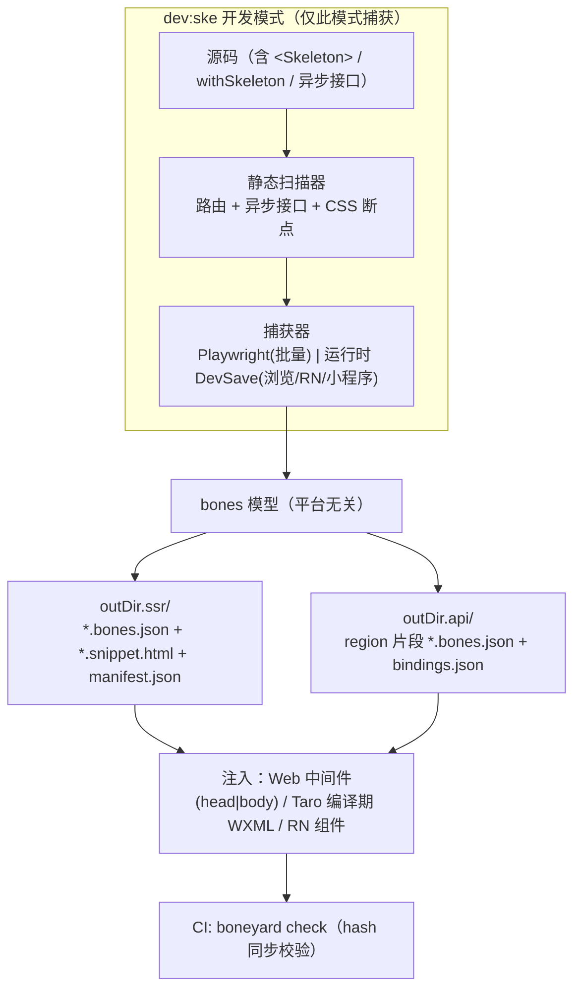
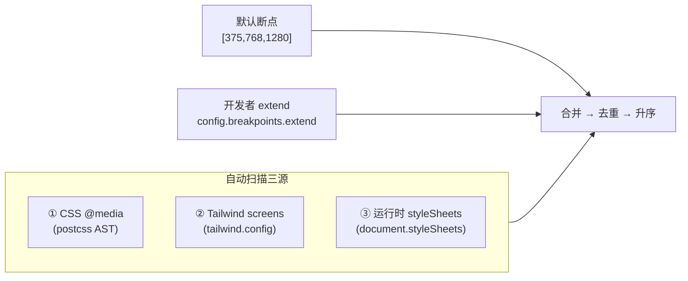
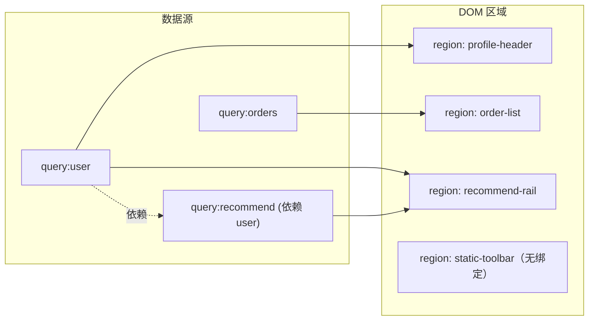

# Boneyard 构建与工作流详细设计

> 配套文档：架构总纲见 [skeleton-architecture-design.md](./skeleton-architecture-design.md)；Web SSR 注入细节见 [ssr-injection-design.md](./ssr-injection-design.md)。
> 本文聚焦"骨架从哪来、怎么自动生成、怎么保证不过期"——即 七层流水线里的 **Capture → Model → Inject** 的工程化与开发者工作流。
> 复用基座：`renderBones()`（[runtime.ts](./runtime.ts)）、`snapshotBones()`（[extract.ts](./extract.ts)）、`computeLayout()`（[layout.ts](./layout.ts)）、Vite 插件（[vite.ts](./vite.ts)）。

---

## 0. 目标（已固化 · 验收标准）

> 本节即"保存目标"。每条目标都给出可验收的判定，后续实现以此为准绳。

| # | 目标 | 验收标准 |
|---|------|----------|
| G1 | **构建时自动生成 SSR 场景骨架到指定目录** | `boneyard build` / `dev:ske` 后，每个页面级路由在 `outDir.ssr` 下生成 `{name}.bones.json` + `{name}.snippet.html` + `manifest.json`，无需手写 |
| G2 | **接口场景：以 API⇄DOM 绑定为核心自动生成到指定目录** | 用 `<Bound>`/`withSkeleton`（或编译期自动）标注数据区域，`dev:ske` 经渲染期依赖追踪建立「dataKey ⇄ region」绑定，按区域写 `outDir.api` 片段并登记 `bindings.json`，运行时按区域渐进揭示（详见 §5） |
| G3 | **CI 时 check 是否同步** | `boneyard check --ci` 对 ssr + api 两类骨架做内容 hash 比对，缺失/过期 → 非零退出 + 注释 |
| G4 | **自动构建在 `dev:ske` 模式下进行** | 普通 `dev` 零开销、零捕获；仅 `dev --ske`（或 `MODE=ske`）激活捕获与回写，HMR 实时更新 |
| G5 | **断点自动扫描包裹组件的 CSS + 开发者扩展 + 默认断点** | 断点集 = 默认 ∪ 自动扫描（@media / Tailwind / 运行时 styleSheets）∪ 开发者 `extend`，去重排序后逐断点捕获 |
| G6 | **SSR 脚本注入位置可降级到 `<head>` 或 `<body>`** | `inject: 'auto' | 'head' | 'body'`；无论落在 head 还是 body，teardown IIFE 都能正确找到 root 并工作 |
| G7 | **三端无感知、精细化、覆盖所有场景** | Web / 小程序(Taro) / RN 同一套 API；粒度到 路由 × 组件 × 区域 × 断点 × 平台；业务方只写业务（至多一个 wrap），机器画不准处用 `data-bp-*` 逃生钩子点一下（§5.7） |
| G8 | **（加分）自动扫描异步接口** | 静态 AST + 运行时 fetch/XHR 探针，识别"有异步数据但无骨架"的组件并告警/自动包裹 |

> **关于"三端"的口径**：本文按 **Web（PC/H5 合并为一端）/ 小程序（Taro）/ RN** 理解。若你的"三端"是别的组合（如 PC/H5/小程序），告诉我，目录与产物矩阵按口径微调即可，设计主体不变。

---

## 1. 总览：一条流水线，两类产物，三端输出



- **两类产物**：`ssr`（页面级首屏骨架，进 HTML/WXML/RN 首帧）与 `api`（组件级接口态骨架，由 HOC 驱动）。两者**模型同构、目录分离、manifest 分离**。
- **三端输出**：同一份 `bones.json` 经不同 Render 后端落地（HTML / WXML / RN 组件）。

---

## 2. 产物模型与目录约定（G1 / G2）

### 2.1 目录结构（可配置）

```
<project>/
  boneyard.config.json
  public/bones/ssr/                 ← outDir.ssr（静态托管，随前端部署）
    home.bones.json
    home.snippet.html
    user-profile.snippet.html
    manifest.json                   ← 路由 → snippet 映射（含每路由断点集、rootSelector、inject 位置）
  src/bones/api/                    ← outDir.api（参与打包，区域片段被引用）
    profile-header.bones.json       ← 区域级片段（per-region，非整组件）
    order-list.bones.json
    order-item.bones.json           ← 列表项片段（揭示时按真实条数重复）
    bindings.json                   ← API ⇄ DOM 区域 绑定图（§5.4）
```

### 2.2 bones.json（两类共用，新增元信息）

```jsonc
{
  "kind": "ssr",                    // 'ssr' | 'api'
  "breakpoints": { "375": {...}, "768": {...}, "1280": {...} },
  "_hash": "渲染后 HTML 内容 hash",  // 已有
  "_sourceFile": "src/pages/Home.tsx",
  "_sourceDeps": ["src/components/Hero.tsx"],   // 浅层依赖（check 用）
  "_sourceHash": "源码内容 hash",   // CI 比对依据（不用 mtime）
  "_breakpointSource": {            // G5：断点来源可追溯
    "default": [375, 1280],
    "scanned": [768],               // 从 @media 扫到
    "extended": []
  },
  "_builtAt": 1718000500000
}
```

### 2.3 manifest.json（ssr）与 bindings.json（api）

```jsonc
// manifest.json（ssr：路由 → snippet）
{
  "version": 1,
  "routes": {
    "/":         { "snippet": "home", "rootSelector": "#root", "inject": "auto", "breakpoints": [375,768,1280] },
    "/user/:id": { "snippet": "user-profile", "rootSelector": "#root", "inject": "auto" }
  }
}
```

api 类**不再是"组件 → bones"，而是「API ⇄ DOM 区域」的绑定图**（详见 §5）。产物是 `bindings.json`：

```jsonc
// bindings.json（api：dataKey ⇄ region，progressive reveal 的依据）
{
  "version": 1,
  "regions": {
    "profile-header": { "deps": ["query:user"],                  "bones": "profile-header.bones.json", "sourceFile": "src/pages/User.tsx" },
    "order-list":     { "deps": ["swr:/api/orders"],             "bones": "order-list.bones.json", "list": { "item": "order-item.bones.json", "count": 6 } },
    "recommend-rail": { "deps": ["query:user","query:recommend"],"bones": "recommend-rail.bones.json" }
  },
  "sources": { "query:recommend": { "dependsOn": ["query:user"] } }
}
```

---

## 3. dev:ske 开发模式（G4）

### 3.1 为什么单独一个模式

普通 `dev` 必须**零开销**：不能因为骨架捕获拖慢日常开发热更新。捕获只在显式 `dev --ske` 时激活。

```bash
# package.json scripts
"dev":      "vite",                          # 普通开发，插件处于 passthrough
"dev:ske":  "vite --mode ske",               # 骨架开发：激活捕获 + 回写 + HMR
"build":    "vite build",                     # 生产构建：批量 Playwright 捕获（CI 用）
"check":    "boneyard check --ci"
```

插件据 `mode === 'ske'` 或 `process.env.BONEYARD_SKE` 决定行为：

```ts
// vite.ts 扩展（伪代码）
export function boneyard(opts: BoneyardOptions): Plugin {
  return {
    name: 'boneyard',
    config(_, env) { this.ske = env.mode === 'ske' || !!process.env.BONEYARD_SKE },
    configureServer(srv) {
      if (!this.ske) return                          // G4：非 ske 模式完全旁路
      registerDevSaveEndpoint(srv, opts)             // POST /__boneyard__/save → 写 outDir
      registerBreakpointScan(srv, opts)              // 提供扫描到的断点给客户端
    },
    transform(code, id) {
      if (!this.ske) return                          // 生产/普通 dev 不注入探针
      return injectCaptureProbes(code, id, opts)     // 注入 HOC / 异步探针（见 §5/§7）
    },
  }
}
```

### 3.2 两条捕获通路（并存互补）

| 通路 | 触发 | 适用 |
|------|------|------|
| **Playwright 批量** | `boneyard build` / CI | 无登录态页面、首次全量、所有断点一次到位 |
| **运行时 DevSave** | `dev:ske` 下开发者实际浏览 | 需登录、动态路由、复杂交互、接口态（必须真实数据渲染后才有布局） |

运行时 DevSave 端点（已在 ssr 文档 §十五设计，这里扩展为支持 ssr + api 两类、写不同目录）：

```ts
srv.middlewares.use('/__boneyard__/save', async (req, res) => {
  // ssr：{ kind:'ssr', name, ... }；api：{ kind:'api', region, deps:[dataKey], ... }（§5）
  const { kind, name, region, deps, result, width, sourceFile } = await readJson(req)
  const id = kind === 'api' ? region : name
  const outDir = kind === 'api' ? opts.outDir.api : opts.outDir.ssr
  const file = resolve(outDir, `${safe(id)}.bones.json`)
  const existing = readIfExists(file) ?? { kind, breakpoints: {} }
  existing.breakpoints[width] = result               // 合并断点（多次浏览积累）
  existing._sourceFile = sourceFile
  existing._sourceHash = hashFiles([sourceFile])
  writeJson(file, existing)
  if (kind === 'ssr') { regenerateSnippet(name, existing, opts); updateManifest('ssr', name, {}, opts) }
  else updateBindings(region, deps, existing, opts)            // 写 bindings.json：region ⇄ deps
  srv.watcher.emit('change', manifestPath(kind, opts))         // HMR
  res.end(JSON.stringify({ ok: true }))
})
```

---

## 4. 断点自动扫描（G5）

断点不该让开发者手填。最终断点集 = **默认 ∪ 自动扫描 ∪ 开发者扩展**，去重升序。

### 4.1 三个扫描来源



**① 静态 CSS @media（构建期，最通用）**：postcss 解析组件 import 链上的 `.css/.scss/.module.css`，收集 `@media (min-width|max-width: Npx)` 的 N。也覆盖 CSS-in-JS（styled-components/emotion）里字符串内的 `@media`。

```ts
function scanCssBreakpoints(entryFile: string): number[] {
  const files = collectStyleImports(entryFile)        // 顺 import 链找样式文件
  const widths = new Set<number>()
  for (const f of files) {
    postcss.parse(readFileSync(f, 'utf8')).walkAtRules('media', rule => {
      for (const m of rule.params.matchAll(/(?:min|max)-width:\s*(\d+)px/g))
        widths.add(Number(m[1]))
    })
  }
  return [...widths]
}
```

**② Tailwind screens（若用 Tailwind）**：读 `tailwind.config.js` 的 `theme.screens`（如 `sm:640 md:768 lg:1024`）→ 直接转断点。

**③ 运行时 styleSheets（dev:ske 兜底，最精确）**：捕获时在浏览器侧读 `document.styleSheets`，遍历 `CSSMediaRule.media.mediaText`，提取像素阈值。这能覆盖动态注入、第三方组件库样式，是静态扫不到的补充。

```ts
// 浏览器侧（dev:ske 捕获脚本内）
function runtimeBreakpoints(): number[] {
  const set = new Set<number>()
  for (const sheet of Array.from(document.styleSheets)) {
    let rules: CSSRuleList | undefined
    try { rules = sheet.cssRules } catch { continue }   // 跨域样式表会抛，跳过
    for (const rule of Array.from(rules ?? [])) {
      if (rule instanceof CSSMediaRule)
        for (const m of rule.media.mediaText.matchAll(/(\d+)px/g)) set.add(Number(m[1]))
    }
  }
  return [...set]
}
```

### 4.2 合并策略与"断点即捕获点"

```ts
function resolveBreakpoints(scanned: number[], cfg: BreakpointConfig): number[] {
  const base = cfg.autoScan ? scanned : []
  return [...new Set([...(cfg.default ?? [375,768,1280]), ...base, ...(cfg.extend ?? [])])]
    .filter(w => w >= (cfg.min ?? 320) && w <= (cfg.max ?? 1920))
    .sort((a, b) => a - b)
}
```

- 每个断点 = 一次捕获（DevSave）或一次 Playwright viewport，写入 `breakpoints[width]`。
- 来源记录进 `_breakpointSource`（§2.2），便于排查"为什么多/少了一个断点"。
- 噪声治理：相邻断点差 < 阈值（默认 24px）自动合并，避免 @media 写得太碎导致捕获爆炸。

---

## 5. 接口态：以「API ⇄ DOM 绑定关系」为核心（G2）

### 5.0 为什么"组件级 pending 闸门"不够（接受批评）

把"一个组件 + 一个 `pending` 布尔 + 快照整棵子树"作为骨架单元，是粗粒度近似，碰到真实业务会失真：

| 真实 case | 组件级方案的失真 |
|-----------|------------------|
| 一个组件里 **多个接口**，各驱动不同区域（头部用户信息 / 列表 / 推荐位） | 整块一起盖骨架、一起揭开 → 已就绪的区域被白白盖住、最慢的接口拖垮整块 |
| **一个接口喂多个区域**（同一份 user 数据，渲染在导航、侧栏、正文） | 无法表达"一份数据 → 多处 DOM" |
| 组件里有 **静态 DOM**（标题、按钮，不依赖接口） | 静态部分被错误地骨架化 |
| **瀑布依赖**：B 接口依赖 A 的结果 | 单一 pending 无法表达分阶段揭示 |
| **列表/无限滚动**：每项依赖同一 query，分页增量 | 整列表一个骨架，无法增量揭示新页 |
| 接口 **报错** | 还在傻盖骨架，不会切错误态 |

> 真正要建模的不是"组件在不在 loading"，而是**「某个数据源（接口/Query）↔ 它实际渲染出的那一块 DOM 区域」的绑定关系**。骨架的本质是：**对每一块"正在等某个数据"的 DOM 区域单独占位，并在它依赖的那个数据到达时单独揭开**（progressive reveal）。

### 5.1 核心模型：绑定图（Binding Graph）



- **节点**：数据源（dataKey，如 `query:user`、`swr:/api/orders`、`fetch:GET /x`）与 DOM 区域（regionId）。
- **边**：`dataKey → regionId` 表示"该区域的渲染依赖该数据"。
- **派生**：区域的"是否显示骨架" = 它入边的所有 dataKey **是否仍有未就绪者**；某区域可被多个 dataKey 约束（全部就绪才揭开），某 dataKey 可揭开多个区域。
- **无入边的区域**（R4）= 静态，**永不骨架化**。

绑定图是接口态骨架的**第一类产物**，比"组件 → bones"精确一个量级。

### 5.2 如何确定绑定：网络层为唯一可靠锚点 + 多信号关联（dev:ske 捕获）

**先承认 Proxy 的天花板。** 纯 Proxy 依赖追踪假设"响应对象原样流到 render"，但真实数据管线会把响应**变形成全新对象**，Proxy 包装在第一步就丢失：

```
fetch 响应  →  normalize 实体  →  写入 store(Redux/Zustand)  →  selector 派生
            →  useMemo 计算  →  解构/map 成新对象  →  props 透传 N 层  →  render
                    ↑ 任意一步 spread/map/JSON.parse 都让 Proxy 身份消失
```

外加 case 极多：一个响应喂多区域、多响应合并成一个视图、瀑布依赖、分页 merge、乐观更新、轮询、WebSocket 推送、SSR hydration 复用、缓存命中不发请求……**靠"追数据对象身份"必然漏。**

**重构思路：不追数据身份，只钉两个可靠的端 + 时间因果。**

| 信号 | 为什么可靠 | 采集方式 |
|------|------------|----------|
| **N 网络层**（唯一总入口） | 不管 fetch / axios / XHR / sendBeacon，最终都过浏览器网络 API | 在 dev:ske 注入期 patch `window.fetch` / `XMLHttpRequest` / （可选）`WebSocket`，给每个请求打 `{reqId, url, method, startT, endT}` |
| **C React commit**（唯一渲染出口） | 任何数据最终要落到 DOM，必经一次 commit | `__REACT_DEVTOOLS_GLOBAL_HOOK__.onCommitFiberRoot` 拿到本次 commit 更新了哪些 fiber → 哪些 DOM 区域 |
| **S 数据层订阅表**（有则最准） | React Query/SWR/Relay **自己维护 key→订阅组件** | 适配器读其 cache/subscriber registry（见 §5.3） |
| **M DOM 变更**（兜底） | 无结构化数据层时仍可观察"效果" | 全文档 MutationObserver + 时间戳 |

> **关键认知：绑定是 dev 期的离线分析产物，不是运行时逻辑。** 所以我们可以在捕获期投入"重"的多信号关联、产出带**置信度**的候选绑定图，交开发者确认/锁定；运行时只读 `bindings.json` + 按 dataKey 订阅状态，依旧极简。这把"复杂度"从线上挪到了可人工兜底的离线分析里。

**三层关联引擎（按可得信号自动选最高 Tier）：**

- **Tier 1 · 数据层订阅表（最精确，零启发式）**
  适配器直接给出 `dataKey → 订阅该 key 的 fiber 列表`（React Query/SWR 本就维护）。再把 fiber 映射到最近的稳定区域锚点 `regionId`，把 `dataKey` 对应的 cache 来源请求与 N 中的 URL 对齐。→ 得到确定边 `request ⇄ dataKey ⇄ region`。

- **Tier 2 · commit × 来源标记（无订阅表时）**
  patch 数据层的 `setState/dispatch/queryClient.setQueryData`，给每次状态写入打上"由哪个 reqId 触发"的标签；`onCommitFiberRoot` 时，把本次 commit 更新的区域归因到该 reqId。

- **Tier 3 · 时间因果兜底（任意管线，含原生 fetch+useState）**
  对每个 commit `C_i`，归因到 `endT ∈ (上次commit, C_i.T]` 且**非用户输入触发**的请求；该 commit 更新的区域 ⇐ 这些请求。窗口内只有一个请求 = 高置信，多个 = 低置信（标记待确认）。

**跨多次浏览聚合稳定化**：同一边在多次 dev:ske 会话中反复出现 → 置信度升高；偶发 → 标记存疑。

```ts
// dev:ske 捕获引擎（伪代码）：网络 + commit + 适配器 三信号关联
const net = patchNetwork()                  // N：reqId/url/timing（fetch/XHR/WS）
onCommitFiberRoot((root) => {               // C：本次 commit 的区域
  const regions = changedRegions(root)      //   updated fibers → data-bp-region 锚点
  if (isInputDriven()) return               //   排除点击/输入引发的 commit
  for (const region of regions) {
    const keys = adapter?.subscribersOf(region)            // Tier 1
      ?? originTagOf(region)                               // Tier 2
      ?? net.resolvedInWindow(lastCommitT, now())         // Tier 3
    const conf = confidenceOf(keys)                        // 1=订阅表 / 0.7=来源标记 / 0.4~窗口唯一性
    snapshotAndPost(region, keys, conf)                    // 区域级快照 + 候选绑定
  }
  lastCommitT = now()
})
```

**区域边界与快照**仍由 `<Bound>` 提供锚点（运行时占位 + dev 期区域定位）：

```tsx
function Bound({ id, children }: { id: string; children: React.ReactNode }) {
  const ref = useRef<HTMLElement>(null)                 // data-bp-region 锚点
  const pending = useRegionPending(id)                  // 运行时：绑定的 dataKey 有未就绪？
  const show = useSkeletonGate(pending)                 // delay/minDuration 防闪烁
  return <div ref={ref} data-bp-region={id}>
    {show ? <SkeletonView bones={getRegionBones(id)} /> : children}
  </div>
}
// dev:ske 下，捕获引擎据 onCommitFiberRoot 找到该 region 并 snapshotBones(ref)，
// 形状来自"加载完成后真实内容布局" → 骨架天然贴合真实 UI。
```

> 这正面回答你的两点：① **网络层是唯一总入口**——所以 N 必抓得全；② **数据操作太复杂、Proxy 不够**——所以**不追数据身份**，改用"网络层(因) × commit/DOM(果) × 数据层订阅表(已知映射)"三信号在 dev 期做带置信度的因果关联，低置信交人工 `<Bound deps>` 锁定。

### 5.3 数据层适配器（把"各种 case"收敛于此）

适配器不再负责 Proxy 追踪，而是暴露两件事：**订阅表**（Tier 1 绑定来源）与**状态订阅**（运行时揭示）：

```ts
export interface DataAdapter {
  /** Tier 1：某 dataKey 当前的订阅 fiber/组件实例（库自带的 subscriber registry） */
  subscribersOf(dataKey: string): Fiber[] | null
  /** dataKey ↔ 触发它的网络请求（用于把 request 对齐到 dataKey） */
  requestOf(dataKey: string): { url: string; method: string } | null
  /** 运行时：订阅 dataKey 状态，驱动区域揭示 */
  subscribe(dataKey: string, cb: (s: 'pending'|'success'|'error') => void): () => void
}
```

| 数据层 | dataKey 来源 | 订阅表 / 状态来源 | 可达 Tier |
|--------|--------------|--------------------|-----------|
| React Query / TanStack | `queryKey` 序列化 | `QueryCache` 的 observers / `query.status` | **Tier 1** |
| SWR | `key` | SWR cache 订阅表 / `isLoading` | **Tier 1** |
| Relay / GraphQL | operation+variables | store 订阅 / fragment ready | **Tier 1** |
| Redux + 自定义 thunk | action/slice | 无标准订阅表 → 用 dispatch 来源标记 | Tier 2 |
| 原生 `fetch`/`axios` + useState | method+url（§7 归一化） | 无 → 时间因果兜底 | Tier 3 |

> 适配器是唯一与数据层耦合的点；**"API 各种 case"被收敛在这里**——有订阅表的库走 Tier 1（精确），没有的自动降级到 Tier 2/3（启发式 + 人工确认），运行时与绑定图结构完全一致。

### 5.4 捕获产物：绑定清单 + 区域片段

```jsonc
// outDir.api/bindings.json —— 绑定图（第一类产物，带置信度与来源）
{
  "version": 1,
  "regions": {
    "profile-header": { "deps": ["query:user"], "bones": "profile-header.bones.json",
                        "anchor": "[data-bp-region=profile-header]",
                        "conf": 1.0, "via": "subscription", "seen": 7 },        // Tier 1
    "order-list":     { "deps": ["swr:/api/orders"], "bones": "order-list.bones.json",
                        "list": { "item": "order-item.bones.json", "count": 6 },
                        "conf": 1.0, "via": "subscription", "seen": 5 },
    "recommend-rail": { "deps": ["query:user","query:recommend"], "bones": "recommend-rail.bones.json",
                        "conf": 0.5, "via": "time-causal", "seen": 2,
                        "review": true }                                        // Tier 3，待人工确认
  },
  "sources": { "query:recommend": { "dependsOn": ["query:user"] } }            // 瀑布依赖（诊断/揭示顺序）
}
```

- `conf`/`via`/`seen`：置信度、关联来源（`subscription`=Tier1 / `origin-tag`=Tier2 / `time-causal`=Tier3）、跨会话出现次数；`review:true` 标记低置信边需人工确认。
- 开发者用显式 `<Bound deps={['swr:/api/orders']}>` 锁定的边 `via:"manual"`、`conf:1.0`，**优先级最高，覆盖一切启发式**（地面真值）。
- 列表区域额外记录 `item` 片段 + 估算 `count`；每个区域片段是独立 `*.bones.json`，按 §4 多断点存储。

### 5.5 运行时：区域级渐进揭示（progressive reveal）

```
对每个 region：
  visible = gate( deps.some(k => status[k] !== 'success') )   // 任一依赖未成功 → 显示骨架
  if (任一 dep === 'error') → 不再盖骨架，交给区域的 error 边界
  dep 全部 success → 该区域揭开（与其他区域互不影响）
```

效果对照 §5.0 的 case：
- 多接口组件 → 各区域**各自**揭开，快的先出，慢的单独转。
- 一接口多区域 → 该接口 success，**它连的所有区域一起**揭开。
- 静态区域 → 立即渲染，从不被盖。
- 瀑布 → 下游区域的 dataKey 自然晚就绪，揭示顺序天然分阶段。
- 列表/无限滚动 → 首屏按 `count` 渲染骨架项；翻页时新页区域单独占位再揭开。
- 报错 → 区域切错误态，不卡骨架。

### 5.6 开发者写法与"无感知"分层（G7）

精确绑定与"零侵入"是有张力的，分三档让开发者按需取舍：

| 档位 | 写法 | 精度 | 适用 |
|------|------|------|------|
| **显式区域**（最精确） | 手动 `<Bound id="order-list">…</Bound>` 包住数据区域 | 区域级 | 复杂页面、一组件多接口 |
| **组件级自动** | `withSkeleton(Comp)`：把组件整体当一个区域 | 组件级 | 简单组件、一组件一接口 |
| **编译期全自动** | babel/SWC 据 §7 扫描在数据读取处自动插 `<Bound>` | 接近区域级（取决于扫描准度） | 追求无感知，容忍少量误差 |

> 自动注入的边界 id 由"源码位置 + dataKey"派生，保证捕获期与运行期 id 稳定一致（绑定能对上）。
> 默认策略：能自动则自动（编译期），开发者可对关键页面用显式 `<Bound>` 提精度——**精细化与无感知由此并存**。

### 5.7 开发者逃生钩子 `data-bp-*`（借鉴 awesome-skeleton / dps）

自动捕获永远有"机器画不准"的节点（广告位、第三方组件、装饰性图标）。借鉴 awesome-skeleton 的 `data-skeleton-*` 与 dps 的 `includeElement/init`，统一为一套 `data-bp-*` 声明式钩子，作用于 ssr 与 api 两类捕获：

| 钩子 | 作用 | 对应竞品 |
|------|------|----------|
| `data-bp-ignore` | 该节点保留原样，不降级为骨架 | awesome `data-skeleton-ignore` |
| `data-bp-remove` | 捕获时整节点移除（不出现在骨架） | awesome `data-skeleton-remove` |
| `data-bp-empty` | 清空 innerHTML 再捕获（去干扰子树） | awesome `data-skeleton-empty` |
| `data-bp-color="#xxx"` | 指定该节点骨架色 | awesome `data-skeleton-bgcolor` |
| `data-bp-shape="circle|rect"` | 强制形状（修正圆形误判） | — |
| `data-bp-text="gradient|block"` | 强制文本渲染方式（见架构 §6.1） | — |

```ts
// 配置式逃生钩子（等价 dps includeElement，给非 JSX 场景用）
{ "skeleton": { "capture": {
  "ignore": ["#ad-banner", ".third-party-widget"],
  "remove": ["#to-top", ".debug-only"],
  "before": "() => document.querySelector('.cookie-bar')?.remove()"  // 等价 dps init()
}}}
```

> 这套钩子是 G5「开发者扩展」与 G7「精细化」在节点级的落点：默认全自动，开发者只在机器画不准处点一下 `data-bp-*`。

---

## 6. SSR 脚本注入位置降级：head 或 body（G6）

现状是注入到 `</body>` 前。降级目标：**脚本无论被放进 `<head>` 还是 `<body>`，teardown 都能正确工作**。

### 6.1 两种注入形态

```
inject: 'body'（首选，最佳 FP）
  </body> 前注入： <style> + <div#__bp>骨架</div> + <script>IIFE</script>

inject: 'head'（降级 / 流式只拿到 head 时）
  <head> 内注入：  <style> + <script>
  其中 <script> 内联 overlay 的 HTML 字符串，boot 时再 createElement 挂到 body
  —— 因为 <div> 不能留在 <head>
```

### 6.2 健壮 IIFE（不假设 DOM 就绪、不假设自身位置）

```html
<script>(function(){
  if (window.__BP_READY__) return; window.__BP_READY__ = true;
  var ROOT = '{{ROOT_SELECTOR}}', MAX_WAIT = {{MAX_WAIT}};
  var OVERLAY_HTML = {{OVERLAY_JSON}};   // head 模式下非空：overlay 的 HTML 字符串；body 模式为空
  var done = false, tries = 0;

  function ensureOverlay() {
    var p = document.getElementById('__bp');
    if (!p && OVERLAY_HTML) {           // head 模式：此刻 body 可能已可用，补挂 overlay
      var t = document.createElement('div'); t.innerHTML = OVERLAY_HTML;
      p = t.firstElementChild; if (document.body && p) document.body.appendChild(p);
    }
    return p;
  }
  function dismiss(p) {
    if (done) return; done = true;
    var s = document.getElementById('__bp_s');
    if (p) { p.classList.add('out'); p.addEventListener('animationend', function(){ p.remove(); s && s.remove(); }, { once:true }); }
    else if (s) s.remove();
  }
  function boot() {
    var p = ensureOverlay();
    var root = document.querySelector(ROOT);
    if (!root) {                         // head 模式可能早于 #root 出现 → 有限重试
      if (tries++ > 60) return dismiss(p);
      return requestAnimationFrame(boot);
    }
    var obs = new MutationObserver(function(muts){
      for (var i=0;i<muts.length;i++) for (var j=0;j<muts[i].addedNodes.length;j++)
        if (muts[i].addedNodes[j].nodeType === 1) { obs.disconnect(); dismiss(p); return; }
    });
    obs.observe(root, { childList:true, subtree:true });
    setTimeout(function(){ obs.disconnect(); dismiss(p); }, MAX_WAIT);   // 兜底
  }
  if (document.readyState === 'loading') document.addEventListener('DOMContentLoaded', boot);
  else boot();
})();</script>
```

要点：
- `DOMContentLoaded` + `requestAnimationFrame` 有限重试 → 即使脚本在 `<head>`、`#root` 尚未解析也能等到。
- head 模式把 overlay 作为字符串内联，boot 时 `createElement` 挂到 body（`<div>` 不滞留 head）。
- `ensureOverlay` 幂等，body 模式直接复用已有 `#__bp`。
- 代价：head 模式骨架可见时刻略晚于 body 模式（多一个 boot 回合），但**覆盖所有注入位置**，是合理降级。

### 6.3 中间件选择逻辑

```
inject: 'auto'：
  Transform Stream 命中 </body> → body 模式（OVERLAY_JSON 置空，直接写 div）
  仅命中 </head>（如流式只 flush 了 head）→ head 模式（OVERLAY_JSON 内联 overlay）
  两者都没有（极端）→ 不注入，透传（铁律三）
```

---

## 7. 异步接口自动扫描（G8 · 加分）

目标：自动发现数据源、并**驱动 §5 的绑定建立**——静态扫描给"候选 dataKey + 在哪个组件读取"，编译期据此在数据读取处自动插入 `<Bound>` 边界（§5.6 编译期全自动档），运行时探针再校正归因。两条腿走路。

### 7.1 静态 AST 扫描（构建期，零运行成本）

识别常见数据层调用，归属到所在组件：

```ts
const ASYNC_SIGNATURES = [
  /useQuery\s*\(/, /useSWR\s*\(/, /useRequest\s*\(/, /useInfiniteQuery\s*\(/, // 数据库
  /\bfetch\s*\(/, /axios\.(get|post|request)\s*\(/,                          // 原生/axios
  /use[A-Z]\w*(Query|Data|List|Detail)\s*\(/,                                // 命名约定
]
function scanAsyncComponents(file: string): Array<{ name: string; trigger: string }> {
  const ast = parse(readFileSync(file,'utf8'), { jsx:true, ts:true })
  const hits: Array<{ name:string; trigger:string }> = []
  walk(ast, node => {
    if (isComponent(node) && bodyMatches(node, ASYNC_SIGNATURES))
      hits.push({ name: componentName(node), trigger: describeTrigger(node) })
  })
  return hits
}
```

产出：`{ name, trigger }` 作为**绑定候选**——编译期据此在该 dataKey 的读取/渲染处插入 `<Bound deps=[dataKey]>`（§5.6），运行时再由 Proxy 依赖追踪确认真实绑定写入 `bindings.json`。

### 7.2 运行时探针（dev:ske，最精确）

静态扫不准（动态拼接、间接封装）时，运行时给 `fetch`/`XHR` 打补丁，把请求归因到"当前正在渲染的 `<Bound>` 区域栈顶"（§5.2 ②），从而建立 `region → dataKey` 边：

```ts
// dev:ske 注入：把网络请求归因到最近的 <Bound> 区域
if (import.meta.env.MODE === 'ske') {
  const orig = window.fetch
  window.fetch = function(...a) {
    const region = currentRegion()                  // §5.2 渲染边界栈顶
    if (region) addEdge(region, 'fetch:' + normalizeUrl(a[0]))   // 写入绑定图
    return orig.apply(this, a)
  }
  // XMLHttpRequest.prototype.open 同理打点
}
```

### 7.3 报告：漏骨架告警

```
boneyard scan

  异步组件覆盖率：14/17
  ✓ user-card        useQuery:user           已有骨架
  ✓ order-list       useSWR:/api/orders       已有骨架
  ⚠ comment-thread   fetch:/api/comments      有异步数据，但无 <Skeleton>/withSkeleton
  ⚠ activity-feed    useInfiniteQuery:feed    无骨架

  建议：对 2 个组件加 withSkeleton（或在 config.api.autoWrap 开启自动包裹）
```

CI 可设阈值：异步覆盖率 < X% 即失败（可选，默认仅告警）。

---

## 8. CI 同步校验（G3）

扩展 `boneyard check`，覆盖 ssr + api 两类，基于内容 hash（非 mtime，避免 checkout 误报，详见 ssr 文档决议 D）：

```
boneyard check --ci

  ssr  (3)        ✓ home   ✓ user-profile   ❌ search  STALE
  api bindings(5) ✓ profile-header  ✓ order-list  ❌ recommend-rail STALE
                  ⚠ comment-thread  UNBOUND(异步数据无 region 绑定/无骨架)

  exit 1
```

```jsonc
// --ci JSON 输出
{
  "ssr":      { "ok":["home","user-profile"], "stale":["search"], "missing":[] },
  "bindings": { "ok":["profile-header","order-list"], "stale":["recommend-rail"], "missing":[],
                "unbound":["comment-thread"] },     // 有异步但无绑定/无骨架
  "exitCode": 1
}
```

判定逻辑：
1. 扫描源码 → 所有 `<Skeleton>`（ssr）+ `bindings.json` 的 region（api）→ 期望集合。
2. 对每个区域片段：bones 缺失 → MISSING；`hashFiles([sourceFile]) !== _sourceHash` → STALE。
3. §7 发现异步 dataKey 但 `bindings.json` 里无对应 region → UNBOUND（默认告警，可配为失败）。
4. 绑定漂移检测：源码里 dataKey 集合与 `bindings.json` 的 `deps` 不一致（接口增删/换 key）→ STALE。
5. pre-commit：`check --staged` 只看暂存涉及的源文件与其 region。

---

## 9. 三端落地与"无感知 / 精细化"（G7）

同一份 `bones.json` → 三端 Render 后端；HOC/CLI/config 三端统一。

| 能力 | Web（PC/H5） | 小程序 / Taro | RN |
|------|--------------|---------------|----|
| SSR/首屏注入 | 中间件 head|body | 编译期 WXML 预置（首帧 `loading:true`） | 组件树首帧占位 |
| 接口态绑定 | `<Bound>`/`withSkeleton` + Proxy 追踪 | 同（Taro 编译，setData 状态驱动揭示） | 同（数据态驱动揭示） |
| 断点扫描 | CSS @media / Tailwind / styleSheets | Taro 样式 @media / 设计稿 rpx 换算 | RN 无 @media → 用 `Dimensions` 断点 + 设计稿宽 |
| 捕获 | Playwright + DevSave | Taro H5 预览态 DevSave + 真机 | RN 调试态 DevSave |
| 拆除信号 | DOM mutation / 数据态 | `setData` 数据态 | InteractionManager + 数据态 |

- **无感知**：业务最多写一个 `withSkeleton`（甚至由编译期自动包裹）；目录、断点、注入、拆除全自动。
- **精细化**：粒度 = 路由 × 组件 × 断点 × 平台；每个维度都能单独覆盖/扩展/降级。
- **覆盖所有场景**：SSR 首屏 / CSR 首屏 / CSR 接口态 × 三端 × 多断点，均由本流水线产出。

---

## 10. 配置 Schema（boneyard.config.json）

```jsonc
{
  "skeleton": {
    "outDir": { "ssr": "public/bones/ssr", "api": "src/bones/api" },
    "platforms": ["web", "miniprogram", "rn"],     // 三端口径，可改

    "breakpoints": {
      "default": [375, 768, 1280],
      "autoScan": true,
      "source": ["css", "tailwind", "runtime"],     // 扫描来源开关
      "extend": [],                                  // 开发者扩展
      "min": 320, "max": 1920, "mergeGap": 24
    },

    "ssr": { "inject": "auto", "rootSelector": "#root", "darkSelector": ".dark", "maxWait": 5000 },

    "api": {
      "boundary": "Bound",                           // 区域边界组件名
      "autoBound": true,                             // 编译期在数据读取处自动插 <Bound>（G7 无感知）
      "granularity": "region",                       // 'region'(精确) | 'component'(粗，整组件一块)
      "dataAdapter": "react-query",                  // react-query | swr | relay | fetch | custom
      "include": ["**/components/**", "**/pages/**"],
      "delay": 120, "minDuration": 300,             // 防闪烁
      "list": { "maxItems": 8 },                     // 列表骨架最大占位项数
      "scanAsync": true                              // G8
    },

    "dev": { "mode": "ske", "endpoint": "/__boneyard__/save" },
    "check": { "ci": true, "unboundAsError": false }
  }
}
```

---

## 11. 完整工作流（开发者视角）

```
1) 平时开发           pnpm dev            # 零开销，无捕获
2) 生成/更新骨架       pnpm dev:ske        # 浏览页面 / 触发接口 → 自动写 outDir.ssr / outDir.api
                                          #   断点自动扫描，HMR 实时更新
3) 提交前             git commit          # pre-commit: boneyard check --staged
4) CI                boneyard check --ci  # ssr 片段 + api 绑定图 hash/漂移 同步校验
5) 生产构建           pnpm build          # Playwright 批量补全所有断点（兜底全量）
6) 运行              中间件/编译期注入     # 三端无感呈现
```

---

## 12. 分期落地

| 阶段 | 内容 | 依赖 |
|------|------|------|
| P0 | `dev:ske` + DevSave 写 ssr 目录 + manifest（G1/G4） | 现有 vite.ts / extract.ts |
| P1 | 断点自动扫描（CSS + 运行时）（G5） | postcss |
| P2 | `<Bound>` + Proxy 依赖追踪 → bindings.json + 区域片段（G2）；运行时区域级渐进揭示 | 调度器（架构 §3，防闪烁）+ 数据层适配器 |
| P3 | SSR 注入 head|body 降级（G6） | 中间件 |
| P4 | `check` 扩展 ssr 片段 + api 绑定图 hash/漂移同步（G3） | P0–P2 产物 |
| P5 | 异步接口静态+运行时扫描（G8）+ 编译期自动插 `<Bound>`（G7） | babel/SWC 插件 |
| P6 | 小程序/Taro + RN Render/捕获后端（G7 三端） | Taro / RN |

---

## 附录：开放问题（需你拍板）

1. **"三端"确切口径**：Web(PC/H5) / 小程序 / RN？还是 PC / H5 / 小程序？（影响 §9 矩阵与 §10 `platforms`）
2. **api 目录是否参与打包**：默认 `src/bones/api`（被 import、tree-shake）；若想纯静态托管可改到 `public/`。
3. **绑定粒度默认值**：`granularity: 'region'`（精确，编译期自动插 `<Bound>`，会多一层包裹 div）还是 `'component'`（粗，整组件一块，零额外 DOM）？建议默认 region、允许逐组件降级。
4. **数据层**：你们主要用 React Query / SWR / Relay / 原生 fetch / 自研 hook？这决定默认 `dataAdapter`（§5.3），也是"API 各种 case"收敛的地方。
5. **未绑定异步是否阻断 CI**：默认告警不阻断（`unboundAsError:false`），是否要更严格？
