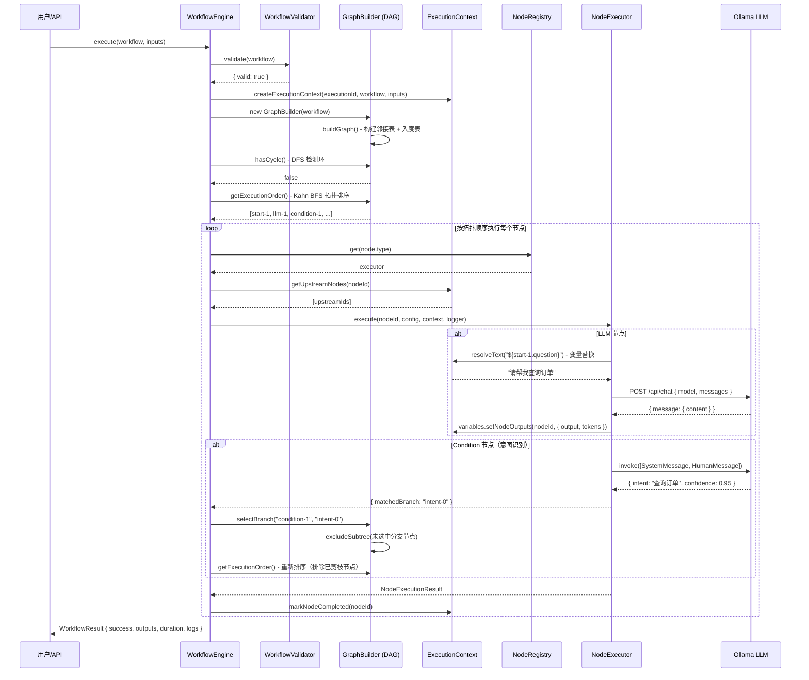
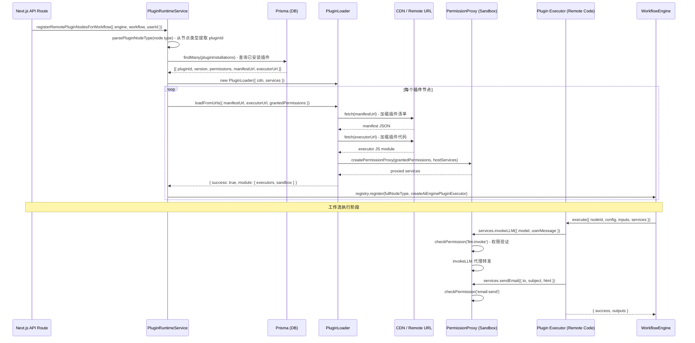
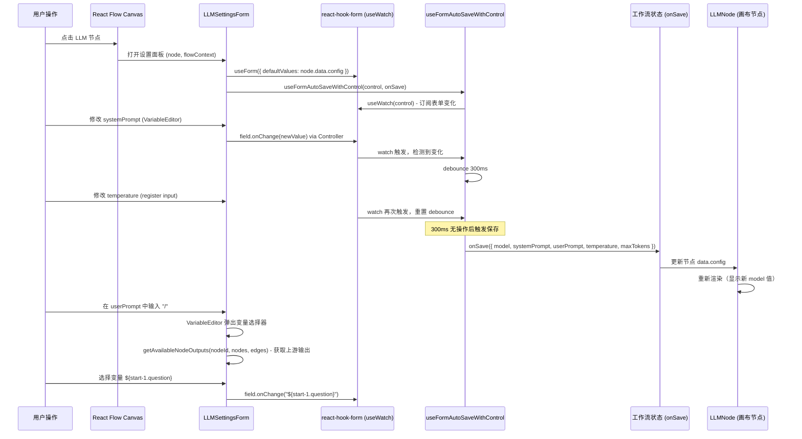
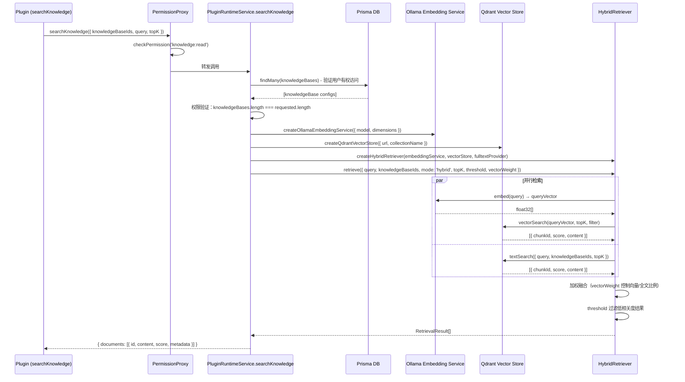

# 妙码 AI 引擎 — 资深前端 Code Review & 简历面试文档

> 以 10 年资深前端视角对本项目进行全面 Code Review，提炼核心技术亮点，供简历撰写与面试答题使用。

---

## 一、项目技术全景

| 维度 | 技术栈 |
|------|--------|
| 前端框架 | Next.js 14 App Router + React 18 |
| 可视化画布 | @xyflow/react（React Flow） |
| 表单管理 | react-hook-form + Controller |
| 状态管理 | React useState / useRef / useMemo（本地状态为主） |
| 样式 | Tailwind CSS + shadcn/ui |
| AI 推理 | Ollama（本地 LLM，qwen3.5:9b） |
| 向量数据库 | Qdrant |
| ORM | Prisma |
| 包管理 | pnpm Monorepo workspace |
| 语言 | TypeScript（全栈） |

---

## 二、Code Review（资深视角）

### 2.1 `llm-node.tsx` — 画布展示节点

**问题：**
```tsx
// ❌ 定义了 setModel/setPrompt 但从未调用 → 死状态
const [model, setModel] = useState<string>((data?.config as any)?.model ?? 'qwen3.5:9b')
const [prompt, setPrompt] = useState<string>((data?.config as any)?.prompt ?? '')
// prompt state 完全没有渲染到 JSX 里
```
- `prompt` state 定义后既不展示也不更新，是**死代码**（dead state）
- `(data?.config as any)` 重复使用 `any` 断言，类型安全缺失
- **节点组件应为纯展示层**（presentational），直接从 `data.config` 读取渲染即可，本地 state 无意义

**亮点：**
- React Flow 的 `NodeProps` + `Handle` 组合实现连接点，架构清晰
- `selected` prop 驱动 border 高亮，无额外状态依赖

---

### 2.2 `condition-settings-form.tsx` — 意图设置表单

**亮点（面试重点）：**
```tsx
// ✅ Debounced Auto-Save：防抖 + Ref 防重复保存
const autoSaveTimerRef = useRef<NodeJS.Timeout | null>(null)
const lastSavedDataRef = useRef<string>('')

useEffect(() => {
    const currentDataStr = JSON.stringify({ model, intents })
    if (currentDataStr === lastSavedDataRef.current) return  // 防重复

    autoSaveTimerRef.current = setTimeout(() => {
        onSave?.({ model, intents: validIntents })
        lastSavedDataRef.current = JSON.stringify({ model, intents: validIntents })
    }, 500)
    // cleanup: clearTimeout
}, [model, intents, onSave])
```

**问题：**
```tsx
// ❌ key={index} 反模式：删除中间项时 React diff 会错位
intents.map((intent, index) => (
    <IntentCard key={index} ... />
))
// 应使用稳定唯一 ID，如 key={intent.id} 或 key={`intent-${index}-${intent.name}`}

// ⚠️ onSave prop 不稳定时会导致 useEffect 无限触发
// 父组件应以 useCallback 包装，或在此处用 useRef 稳定引用
```

---

### 2.3 `llm-settings-form.tsx` — LLM 参数表单

**亮点（面试重点）：**
```tsx
// ✅ 正确区分 register（原生 input）和 Controller（自定义组件）
// 原生 input 直接 register
{...register('temperature', { valueAsNumber: true, min: 0, max: 2 })}

// 自定义富文本编辑器用 Controller
<Controller name="systemPrompt" control={control}
    render={({ field }) => <VariableEditor value={field.value} onChange={field.onChange} />}
/>

// ✅ 自定义 Hook 封装自动保存逻辑
useFormAutoSaveWithControl(control, onSave, true)
```

- `assistantPrompt`（预填 Assistant 回复开头）体现对 Chat Completion API **prefill** 特性的深度理解
- `systemPrompt + userPrompt + assistantPrompt` 完整实现多角色 prompt 架构

**问题：**
```tsx
// ❌ 同一对象被 as any 解构 6 次，应统一类型定义
const config = node.data?.config as LLMNodeConfig  // 一次断言即可
```

---

### 2.4 `global-header.tsx` — 全局导航

**亮点：**
```tsx
// ✅ 多路径精确匹配：/apps 和 /app 同时激活导航项
const isNavActive = (item) => {
    if (item.matchPaths) {
        return item.matchPaths.some(path => pathname.startsWith(path))
    }
    return pathname.startsWith(item.url)
}
```
- 用户信息懒加载（useEffect fetch）+ Avatar fallback 降级展示
- `navItems` 数组配置化驱动渲染，扩展导航无需修改 JSX

---

### 2.5 `plugin-runtime-service.ts` — 插件运行时服务（核心）

**这是项目最有架构价值的文件，面试重点：**

```typescript
// ✅ 插件宿主服务注入（Host Services Pattern）
function createWorkflowPluginHostServices(userId: string) {
    return {
        fetch: globalThis.fetch,           // 网络访问
        getEnv: (key) => process.env[key], // 环境变量
        sendEmail: ...,                     // 邮件服务
        invokeLLM: async (options) => {    // LLM 调用代理
            // 直接调用 Ollama REST API
        },
        searchKnowledge: async (options) => {
            // Hybrid RAG：向量检索 + 全文检索
        },
    }
}
```

**问题：**
```typescript
// ⚠️ 多知识库场景下只取第一个知识库的 embeddingModel
const primaryKnowledgeBase = knowledgeBases[0]  // 其余知识库的配置被忽略

// ⚠️ 不安全的 as any 转型
const results = await (vectorStore as any).textSearch(...)
// vectorStore 类型应补充 textSearch 方法声明
```

---

### 2.6 `run-workflow.ts` — 工作流执行示例

**亮点：**
- 清晰演示了完整的工作流执行链路
- CLI 参数控制 `--simple` 选择不同工作流，开发体验好
- `${start-1.userName}` 模板变量语法体现了节点间数据传递的设计

---

## 三、核心架构深度解析

### 3.1 工作流引擎执行原理

**Kahn 算法（BFS 拓扑排序）实现：**

```typescript
// GraphBuilder.getExecutionOrder()
// 1. 计算所有节点入度
// 2. 入度为 0 的节点入队
// 3. 执行节点，将其后继节点入度 -1
// 4. 入度变 0 时入队 → 实现依赖顺序执行

// 条件分支：动态排除子树
selectBranch(conditionNodeId, selectedBranchId) {
    // 将未选中分支的所有下游节点加入 excludedNodes
    // 重新 getExecutionOrder() 只返回选中路径的节点
}
```

### 3.2 插件沙箱 + 权限代理模式

```
Plugin Code
    ↓ 调用
PermissionProxy (createPermissionProxy)
    ↓ 验证 grantedPermissions
Host Services (fetch / LLM / Email / Knowledge)
```

每个能力（网络、LLM、邮件、知识库）对应独立权限（`network`、`llm:invoke`、`email:send`、`knowledge:read`），通过 Proxy 模式在运行时拦截并验证。

### 3.3 Hybrid RAG 检索

```
用户 Query
    ├─ 向量检索（Qdrant + Ollama Embedding）
    └─ 全文检索（textSearch）
        ↓ Hybrid Retriever 加权融合
    TopK 相关文档块
        ↓ 注入 LLM 上下文
    生成回答
```

---

## 四、时序图

### 时序图 1：工作流执行引擎完整流程



---

### 时序图 2：插件注册与执行流程（Plugin Runtime）



---

### 时序图 3：前端可视化编辑器 → 节点设置自动保存



---

### 时序图 4：Hybrid RAG 知识库检索流程



---

## 五、简历亮点术语提炼

### 项目描述（简历用）

> 主导开发基于 React Flow 的**低代码 AI 工作流编辑器**，实现可视化 DAG 编排、插件化节点扩展与本地 LLM 驱动的智能意图路由；自研工作流执行引擎，采用 Kahn 算法拓扑排序保障节点依赖正确执行，支持动态分支剪枝与实时流式日志回调。

---

### 技术亮点关键词（按重要度）

#### 🔥 核心引擎架构
- **DAG 工作流引擎**（Directed Acyclic Graph Workflow Engine）
- **Kahn 算法 / BFS 拓扑排序**（Topological Sort for Node Execution Ordering）
- **动态分支剪枝**（Dynamic Subtree Pruning for Conditional Routing）
- **节点注册中心 / Strategy 模式**（Node Registry + Strategy Pattern）
- **执行上下文 / 变量解析器**（Execution Context + Variable Resolver with `${nodeId.key}` interpolation）

#### 🔥 插件系统
- **权限沙箱 / Proxy 模式**（Permission Sandbox via Proxy Pattern）
- **插件动态加载**（Dynamic Plugin Loading from Remote CDN/URL）
- **宿主服务注入**（Host Services Injection）
- **声明式权限模型**（Declarative Permission Model: `network`, `llm:invoke`, `email:send`, `knowledge:read`）

#### 🔥 AI / RAG 能力
- **Hybrid RAG 检索**（向量检索 + BM25 全文检索加权融合）
- **Ollama 本地 LLM 集成**（Local LLM via Ollama REST API）
- **LLM 意图识别 + 条件路由**（LLM-based Intent Classification with Confidence Score）
- **Qdrant 向量数据库**（Qdrant Vector Store with filtered search）
- **多角色 Prompt 架构**（System / User / Assistant Prompt with Prefill）

#### 🔥 前端工程化
- **React Hook Form + Controller 模式**（Controlled Components for Custom Editors）
- **Debounced Auto-Save with useRef**（防抖自动保存，避免重复请求）
- **React Flow 自定义节点**（Custom Node with Handle Connectors）
- **pnpm Monorepo**（Turborepo-style workspace with shared packages）
- **Next.js App Router + Server Components**

---

### 面试高频问题 & 答题要点

#### Q1：工作流引擎是怎么保证节点按正确顺序执行的？

**答：** 使用 **Kahn 算法（BFS 拓扑排序）**。构建 `GraphBuilder` 时计算每个节点的入度，将入度为 0 的节点入队，依次出队执行，执行后将后继节点入度减一，入度变为 0 则加入队列。这样天然保证了所有上游依赖执行完才执行当前节点，时间复杂度 O(V+E)。

#### Q2：条件分支是怎么处理的？

**答：** `ConditionExecutor` 调用本地 Ollama LLM 做**意图识别**，要求严格返回 JSON 格式 `{intent, confidence}`，并有 fallback（正则提取 → 默认第一个意图）。匹配到意图后返回 `matchedBranch: 'intent-0'`，引擎调用 `GraphBuilder.selectBranch()` 将未选中分支的所有下游节点递归加入 `excludedNodes`，重新获取执行顺序时自动跳过这些节点。

#### Q3：插件系统如何保证安全性？

**答：** 三层保障：① **声明式权限**：插件 manifest 声明需要的权限；② **安装时授权**：用户安装插件时确认权限列表；③ **运行时 Proxy 拦截**：`createPermissionProxy` 包装所有宿主服务，每次调用前 `checkPermission()`，权限不足立即抛出 `PermissionDeniedError`，插件代码无法绕过。

#### Q4：LLM 表单的自动保存是怎么实现的？

**答：** 两种方案分别在两个组件中：
- `LLMSettingsForm`：通过 `react-hook-form` 的 `useWatch(control)` 监听表单变化，在自定义 Hook `useFormAutoSaveWithControl` 中 debounce 后调用 `onSave`，避免每次按键都触发保存，同时不会导致父组件重渲染（因为 `control` 是稳定引用）。
- `ConditionSettingsForm`：手动 `useState` + `useEffect` + `useRef` 实现，用 `lastSavedDataRef` 存储上次保存的 JSON 字符串做 diff，避免相同数据重复保存。

#### Q5：Hybrid RAG 相比纯向量检索有什么优势？

**答：** 向量检索擅长**语义相似性**（能找到"意思相近"的文档），但对**精确关键词**（如产品编号、人名）召回率低。全文检索（BM25）正好相反，擅长精确匹配但无法理解语义。Hybrid Retriever 通过 `vectorWeight` 参数控制两者的加权比例融合排序，兼顾了语义理解与精确匹配，在实际 RAG 场景中召回率通常提升 10-20%。

#### Q6：React Flow 自定义节点有哪些注意事项？

**答：** ① **节点组件应为纯展示组件**，仅从 `data` props 读取，不持有本地状态（本项目 `llm-node.tsx` 有 dead state 问题）；② `Handle` 组件必须设置正确的 `type`（source/target）和 `position`，sourceHandle ID 要与 edge 的 `sourceHandle` 字段对应（如 `intent-0`），条件分支路由依赖此机制；③ 频繁节点更新时需注意 React 的 `memo` 或 `useCallback`，避免整个画布重渲染。

---

## 六、代码质量总结

| 模块 | 质量评分 | 主要问题 | 亮点 |
|------|---------|---------|------|
| `llm-node.tsx` | ⭐⭐⭐ | dead state，过多 `as any` | 节点结构清晰 |
| `condition-settings-form.tsx` | ⭐⭐⭐⭐ | `key={index}` 反模式 | debounce auto-save，lastSavedRef diff |
| `llm-settings-form.tsx` | ⭐⭐⭐⭐⭐ | `as any` 重复 | RHF Controller 正确使用，prefill 支持 |
| `global-header.tsx` | ⭐⭐⭐⭐ | 无 loading state | matchPaths 灵活导航 |
| `plugin-runtime-service.ts` | ⭐⭐⭐⭐ | 多知识库配置问题，`as any` | 插件沙箱设计优秀 |
| `WorkflowEngine` (engine.ts) | ⭐⭐⭐⭐⭐ | — | DAG + 拓扑排序 + 分支剪枝完整实现 |
| `GraphBuilder` (graph-builder.ts) | ⭐⭐⭐⭐⭐ | — | Kahn BFS + DFS 环检测，双向邻接表 |
| `PermissionProxy` | ⭐⭐⭐⭐⭐ | console.log 生产代码 | Proxy 权限拦截设计优雅 |

---

*生成时间：2026-06-11 | 项目：miaoma-aiflow-v2*
