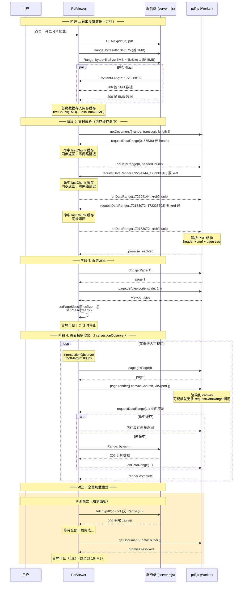

# PDF 分片渲染时序图



## 关键优化点

| 优化 | 说明 |
|------|------|
| 并行预取 | HEAD + 首 1MB + 尾 5MB 同时发起，减少串行等待 |
| 内存缓存 | 首尾数据驻留内存，pdf.js 请求时同步返回，零网络延迟 |
| PDFDataRangeTransport | 接管所有网络请求，确保每条请求都带 Range 头 |
| URL 直接加载 | pdf.js 通过 url 参数发起 Range 请求（206 Partial Content） |
| IntersectionObserver | 仅渲染可见页 ±800px，按需加载页面资源 |

## 为什么之前慢

```
pdf.js 需要 xref 表 → 发 Range 请求 → 等网络 → 回来 → 还需要下一段 xref → 再发请求 → 再等...
                                        ↑
                                    几十次往返 = 3-4 秒
```

现在 xref 表已经在内存里，pdf.js 要什么直接给，零等待。