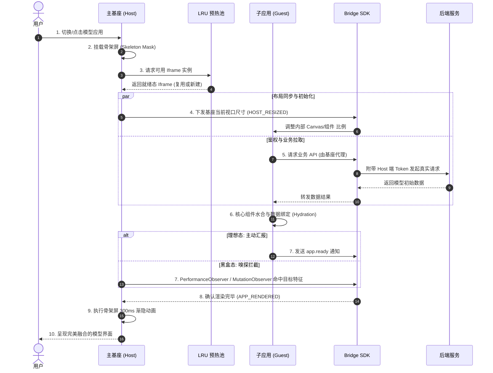
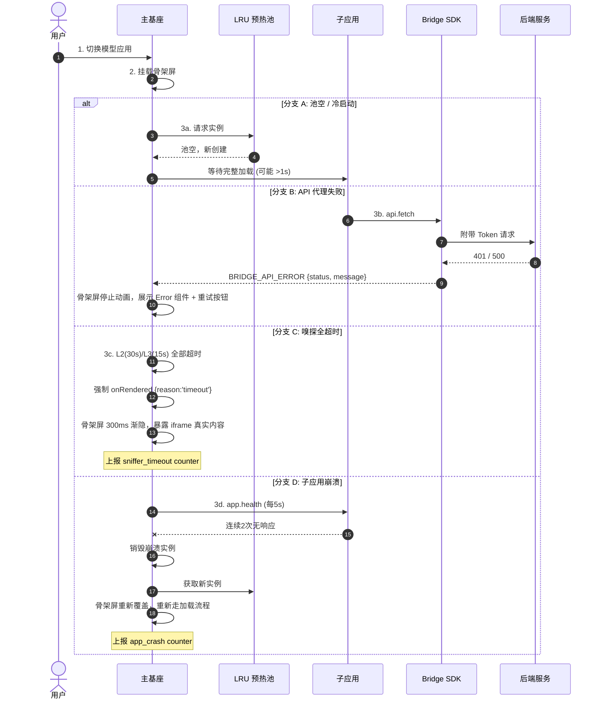

# 软件设计文档 (SDD)：星轨 (Orbit) v2.0 - 异构微前端架构设计

> **版本:** v2.1 | **日期:** 2026-06-12 | **上游:** [tech.md](./tech.md) (v2.0 原文)
> **改进摘要:** 协议安全加固、跨域嗅探降级、防死循环兜底、心跳恢复、可观测性埋点。详见末尾 §8 变更记录。

## 1. 概述与背景

随着 AI 业务的爆发，前端控制台需要接入大量由不同算法团队开发的异构模型 Demo（技术栈涵盖 Python Streamlit, Gradio, 原生 WebGL, React 等）。
为了在不魔改异构子应用代码的前提下，实现**物理防爆隔离**、**极速冷启动**与**丝滑的单页级用户体验**，特设计本套纯 `iframe` 架构演进方案——星轨 (Orbit) v2.0。

### 1.1 硬约束与边界

| 约束 | 来源 | 应对 |
|---|---|---|
| 不可修改黑盒子应用源码 | 算法团队自主选型 | 全部适配逻辑落在基座 / Bridge 侧 |
| DOM/JS 物理隔离，任一子应用崩溃不影响基座 | 安全需求 | 纯 `iframe`；禁用 `document.domain` 降级 |
| WebGL Context 不丢失 | GPU 加速模型（3D 点云） | iframe 卸载前确认无活跃 GL Context；预热池不共享 GL Context |
| Token 只存在于基座内存 | 安全审计 | Bridge 代理模式；CSRF Token 经 Bridge 注入 HTTP Header |

### 1.2 核心非功能性指标 (NFR)

| ID | 指标 | Target | 测量方式 |
|---|---|---|---|
| **NFR-P1** | 首帧加载 (冷启动) | P95 < 1s | `performance.now()` user-click → `APP_RENDERED` |
| **NFR-P2** | 预热池命中加载 | P95 < 300ms | 同上，命中池场景 |
| **NFR-P3** | 布局抖动 | 0 次 >5px Layout Shift | Layout Instability API / Chrome Performance |
| **NFR-P4** | 子应用崩溃恢复 | 自动恢复 < 3s | 心跳超时 → 重建 → 新 `APP_RENDERED` |
| **NFR-P5** | 预热池并发内存 | < 150MB (3 实例) | Chrome Memory Profiler |
| **NFR-M1** | Token 泄露 | 0 | Code Review + Penetration Test |

## 2. 设计目标

1. **绝对的物理防爆边界：** 必须隔离 DOM 和 JS 上下文，防止不可信代码导致主基座崩溃，保证 GPU 加速资源（WebGL）的独立运作。
2. **零闪烁无感知加载：** 消灭 `iframe` 传统的白屏和布局抖动，视觉控制权 100% 收归主基座。
3. **极速可用状态：** 模型冷启动从 `> 5秒` 缩短至 `< 1秒`（通过预热池和预加载缓存）。
4. **单点事实与安全穿透：** 鉴权 Token 统一由基座保管，子应用通过高频消息总线或拦截代理获得网络能力，确保权限同步。

## 3. 架构全景蓝图

系统核心由四大引擎支撑：

* **核心 1：通信与控制总线 (Bridge SDK)**
  * **机制：** 基于 **JSON-RPC 2.0** 规范封装 `postMessage`，实现 Promise 双向异步调用 `IframeBridge`。
  * **协议：** 每条消息携带 `jsonrpc: "2.0"` 版本号；支持 `request`（需响应）、`response`（携带 `result`/`error`）和 `notification`（单向广播，不期望回复）三种消息类型。
  * **安全：** 生产环境 `targetOrigin` 必须显式指定，禁止 `'*'` 通配符。收到未注册的 method 返回标准 JSON-RPC error `{-32601, "Method not found"}`。
  * **能力：** 支持超时熔断（`BridgeTimeoutError`）；支持"UI 越权"（子应用指挥基座渲染全局弹窗，突破流式布局限制）。

* **核心 2：无感知预热池 (LRU Iframe Pool)**
  * **机制：** 在非可视区域 (`position:absolute; left:-9999px`) 维护常驻的 `iframe` 节点队列。
    > ⚠️ 与 v2.0 原文不同：使用 `left:-9999px` 而非 `visibility:hidden`，因后者会让浏览器降低 iframe 渲染优先级，导致预热失去意义。
  * **容量：** 最大并发量 `maxSize: 3`，基于 LRU 淘汰。实例取出后立即异步补充。
  * **老化：** 池中实例超过 5 分钟未被使用 → 自动销毁（`removeChild` + 清空 listener + `src='about:blank'`）。
  * **节能：** `document.hidden` 时暂停预加载，避免后台消耗用户资源。
  * **能力：** 将庞大的前端框架（如 Streamlit）拉起、加载解析 JS、WebSocket 握手的时间耗费转移到用户闲置后台。

* **核心 3：流式布局与响应式防线 (Layout & Resize Guard)**
  * **布局反转：** 坚持基座霸权，使用 `overflow:hidden; min-height:0; contain:layout style;` 死死锁死 iframe 的外层容器边界。
  * **尺寸探针：** 基座侧监听容器 `width` 并高频下发；子应用内部监听内容 `height` 并高频上报。
  * **防崩溃锁（增强版）：**
    - `requestAnimationFrame` 合并同一帧内的多次触发
    - `lodash.debounce` 消抖
    - `5px` 变化容差阈值（Threshold），低于阈值跳过同步
    - **新增兜底：** 连续 3 次因阈值跳过之后，第 4 次强制同步一次，防止长时间微小漂移导致内容被持续裁剪

* **核心 4：复合视觉嗅探状态机 (Hybrid Sniffer & Handover)**
  * **白盒应用（L1）：** 接收 SDK 抛出的 `app.ready` 通知 —— 触发即完成，无需等待其他层级。
  * **黑盒应用（L2 - 网络嗅探）：** 使用 `PerformanceObserver` 监听特定 WebSocket URL pattern（如 `/_stcore/stream`, `/queue/join`）。
    > ⚠️ **重要约束：** 非同源 iframe 必须配置 `Timing-Allow-Origin` 响应头才能获取完整 timing 数据；无配置时自动降级到 L3，不会静默失败。
  * **黑盒应用（L3 - DOM 探测）：** 注入 `MutationObserver` 探测核心组件（如 `.gradio-container`）是否挂载及子节点数达标。
  * **超时兜底：** L2 30s / L3 15s 超时后强制 `onRendered({reason:'timeout'})`，绝不永久阻塞。
  * **视觉平滑交接：** 探测成功后，覆盖在 iframe 表层的骨架屏不直接消失，而是执行 `300ms` 的 `opacity` 渐隐，`transitionend` 后移除骨架屏 DOM 节点。
  * **Observer 清理：** `onRendered` 触发后立即 `disconnect` 所有 Observer，防止内存泄漏。

### 3.1 新增：心跳与崩溃恢复

* 基座侧每 **5s** 通过 Bridge 向子应用发送 `app.health` 探活请求。
* 连续 **2 次** 无响应（共 10s）→ 判定子应用崩溃：
  1. 销毁当前 iframe（`removeChild` + 清空引用）
  2. 从预热池获取新实例或冷启动
  3. 上报 `app_crash{app_id}` counter 到监控系统
* 恢复过程对用户表现为：骨架屏重新覆盖 → 同正常加载流程 → 渐隐。

## 4. 核心系统时序图

### 4.1 正常流程



### 4.2 异常流程



## 5. API 与核心模块接口定义

### 5.1 异步通信 Bridge SDK 定义

基于 JSON-RPC 2.0 规范的双向 RPC。

```typescript
// ---- 常量 ----
const BRIDGE_PROTOCOL_VERSION = '2.0';

// ---- JSON-RPC 2.0 协议类型 ----
type RpcId = string; // UUID v4

interface JsonRpcRequest<T = any> {
  jsonrpc: '2.0';
  id: RpcId;
  method: string;       // 如 'auth.getToken', 'ui.showModal'
  params?: T;
}

interface JsonRpcSuccessResponse<T = any> {
  jsonrpc: '2.0';
  id: RpcId;
  result: T;
}

interface JsonRpcErrorResponse {
  jsonrpc: '2.0';
  id: RpcId;
  error: {
    code: number;       // JSON-RPC 标准错误码 + 自定义扩展
    message: string;
    data?: any;         // 额外上下文（堆栈等）
  };
}

interface JsonRpcNotification<T = any> {
  jsonrpc: '2.0';
  method: string;
  params?: T;
  // 注意：Notification 没有 id
}

type JsonRpcMessage = JsonRpcRequest | JsonRpcSuccessResponse | JsonRpcErrorResponse | JsonRpcNotification;

// ---- 标准错误码 ----
enum BridgeErrorCode {
  PARSE_ERROR = -32700,
  INVALID_REQUEST = -32600,
  METHOD_NOT_FOUND = -32601,
  INVALID_PARAMS = -32602,
  INTERNAL_ERROR = -32603,
  // 自定义扩展
  TIMEOUT = -32000,
  TARGET_ORIGIN_BLOCKED = -32001,
}

// ---- 核心类 ----
class IframeBridge {
  // targetOrigin 生产环境必须显式传入，不再默认 '*'
  constructor(targetWindow: Window, targetOrigin: string);

  // 解析并路由收到的消息
  private async handleMessage(event: MessageEvent): Promise<void>;

  // RPC call: 发送 request，返回 Promise<result>，超时 reject BridgeTimeoutError
  public request<T>(method: string, params?: any, timeoutMs?: number): Promise<T>;

  // 注册方法处理器，供对方调用。handler 返回 Promise 时自动 await
  public on(method: string, handler: (params: any) => any | Promise<any>): void;

  // 移除已注册的方法处理器
  public off(method: string): void;

  // 发送单向通知（不等待响应）
  public notify(method: string, params?: any): void;

  // 握手：发送 version 宣告，检查对方是否兼容
  public handshake(): Promise<{ version: string; capabilities: string[] }>;
}

// ---- 预定义能力清单 ----

/** Host → Guest: Host 暴露给子应用调用的方法 */
enum HostMethods {
  AUTH_GET_TOKEN = 'auth.getToken',
  API_FETCH = 'api.fetch',
  UI_SHOW_MODAL = 'ui.showModal',
  UI_SHOW_TOAST = 'ui.showToast',
}

/** Guest → Host: 子应用暴露给基座调用的方法 */
enum GuestMethods {
  APP_HEALTH = 'app.health',
  APP_READY = 'app.ready',         // L1 主动就绪信号 (notification)
  LAYOUT_CONTENT_HEIGHT = 'layout.contentHeight', // 内容高度上报 (notification)
  APP_GET_STATE = 'app.getState',
}
```

### 5.2 LRU 预热池接口定义

```typescript
interface PoolEntry {
  url: string;
  iframe: HTMLIFrameElement;
  lastAccessedAt: number;
}

class IframePoolManager {
  private maxSize: number; // 默认 3
  private staleTimeoutMs: number; // 默认 5 * 60 * 1000 (5 min)
  private entries: Map<string, PoolEntry>;

  // 静默预加载核心资源（document.hidden 时为 no-op）
  public preload(url: string): void;

  // 获取可用的沙箱实例（命中→返回并记录 LRU 时间戳 + 异步补充；未命中→新建）
  public getSandbox(url: string): HTMLIFrameElement;

  // 归还实例到池（重置内部状态后重新可用）
  public releaseSandbox(iframe: HTMLIFrameElement, url: string): void;

  // 清理超过 staleTimeoutMs 未使用的实例（定时器驱动）
  public evictStaleNodes(): void;

  // 销毁指定实例（removeChild + 清空 listener + src='about:blank'）
  private destroyEntry(entry: PoolEntry): void;

  // 获取池当前状态（用于监控）
  public getStats(): { size: number; entries: { url: string; idleMs: number }[] };
}
```

### 5.3 混合视觉嗅探器定义

```typescript
// 框架特征配置
interface FrameworkProfile {
  type: 'gradio' | 'streamlit' | 'custom';
  /** L2: WebSocket/HTTP URL 匹配正则（PerformanceObserver 用） */
  wsPattern?: RegExp;
  /** L3: MutationObserver 监听的目标 DOM selector */
  domSelector?: string;
  /** L3: selector 下最少子节点数才视为就绪（防止空壳误判） */
  domMinChildren?: number;
}

type SnifferResult =
  | { level: 'L1'; reason: 'bridge_signal' }
  | { level: 'L2'; reason: 'ws_handshake'; matchedUrl: string }
  | { level: 'L3'; reason: 'dom_ready'; selector: string; childCount: number }
  | { level: 'TIMEOUT'; reason: 'all_layers_exhausted' };

function watchIframeReady(
  iframeWindow: Window,
  profile: FrameworkProfile,
  onRendered: (result: SnifferResult) => void,
  options?: { l2TimeoutMs?: number; l3TimeoutMs?: number }
): { abort: () => void } {
  // 返回 abort 函数供外部取消探测

  // 逻辑:
  // 1. L1: 注册 Bridge handler 监听 'app.ready' → 触发立即返回
  // 2. L2: PerformanceObserver 监听 resource/measure 含 wsPattern
  //    → 若同源或 Timing-Allow-Origin 存在 → 获取完整 timing
  //    → 否则自动静默降级，不触发 L2
  // 3. L3: MutationObserver 监听 domSelector → selector 存在且子节点数 ≥ domMinChildren → 触发
  // 4. 任一 layer 触发 → disconnect 所有 observer → 清空 timer → 调用 onRendered
  // 5. 所有 layer 超时 → 强制 onRendered({level:'TIMEOUT'})
}
```

### 5.4 布局同步观察器

```typescript
interface LayoutSyncConfig {
  /** 变化容差阈值 (px)，低于此值跳过同步，默认 5 */
  thresholdPx: number;
  /** 连续跳过多少次后强制同步，默认 3 */
  forceSyncAfterSkips: number;
  /** 防抖延迟 (ms)，默认 16 (~1 frame) */
  debounceMs: number;
}

class LayoutSyncObserver {
  constructor(config?: Partial<LayoutSyncConfig>);

  /**
   * Host 侧：监听容器尺寸变化，通过 Bridge 下发给子应用。
   * 应在 Host 侧组件挂载时调用。
   */
  public observeHost(
    containerEl: HTMLElement,
    bridge: IframeBridge
  ): void;

  /**
   * Guest 侧：监听 document.body 高度变化，通过 Bridge 上报给基座。
   * 应在子应用 SDK 初始化时调用。
   */
  public observeGuest(
    bridge: IframeBridge
  ): void;

  /** 停止所有监听 */
  public disconnect(): void;

  // 内部防循环机制：
  // 1. requestAnimationFrame 合并同帧内的多次 resize 事件
  // 2. debounce 消抖
  // 3. |newSize - oldSize| < thresholdPx → 跳过，skipCounter++
  // 4. skipCounter >= forceSyncAfterSkips → 强制同步，skipCounter 归零
  // 5. 实际同步时 skipCounter 归零
}
```

## 6. 异常应对机制（降级方案 + 可观测性）

| 风险场景 | 影响后果 | 应对降级方案 (Fallback) | 监控埋点 |
| :--- | :--- | :--- | :--- |
| **API/Token 代理请求失败** | 模型彻底不可用，数据接口返回 401 | Bridge 向基座抛出 `BRIDGE_API_ERROR` 事件，骨架屏停止动画，切换为"全局断网/授权异常"错误页提供重试按钮。重试时重置所有 Sniffer 重新走加载流程。 | `bridge_api_error{status, method}` counter |
| **Gradio/Streamlit DOM 探测全失败** | 骨架屏长久覆盖，死锁白屏 | 嗅探器内部设定分级 timeout（L3: 15s, 全局: 30s），无论是否真正成功，到达超时时间强制 `resolve({level:'TIMEOUT'})`，渐隐骨架屏，暴露可能仍在加载中的原始 `iframe` 界面作为最后的兜底。 | `sniffer_timeout{framework}` counter |
| **跨域导致 ResizeObserver / PerformanceObserver 失效** | 内部存在滚动条；L2 嗅探失效 | 1) 配置主基座 Nginx 将模型环境挂载在相同的二级域名下（如同源策略 `example.com/models/xxx`），强制变为可操控状态。2) PerformanceObserver 无法获取 timing 时自动降级到 L3 DOM 探测，不在 L2 层面死等。 | `sniffer_l2_degraded{cause:'cross_origin'}` gauge |
| **子应用崩溃 (WebGL OOM / JS Exception)** | iframe 白屏，用户无感知 | 基座每 5s 发送 `app.health` 心跳，连续 2 次无响应 → 判定崩溃 → 销毁 iframe → 从池中获取新实例或冷启动 → 骨架屏重新覆盖 → 正常加载流程。 | `app_crash{app_id}` counter |
| **预热池实例资源泄漏** | 内存持续增长 | `evictStaleNodes()` 定时器每 60s 运行，清理闲置 >5min 的实例；`getStats()` 暴露池状态到 DevTools / 监控面板。 | `pool_size`, `pool_memory_mb` gauge |
| **`targetOrigin` 不匹配** | 消息被浏览器静默丢弃 | 1) 构造时强制传入 origin，不做默认值回退；2) `handshake()` 超时未响应 → 抛出 `BridgeTimeoutError` 并记录 `targetOrigin` 到 console warning。 | `bridge_handshake_timeout` counter |

## 7. 附录：模块开发指引 (AI Prompt 参考)

> *使用说明：请将以下 Prompt 分三次发送给 Cursor / Claude / Gemini，让其逐步生成底层核心代码。*
>
> **注意：这些 Prompts 是代码生成辅助材料，不等同于 spec。最终实现应参考 §1-§6 的正式需求。Prompts 建议独立维护在 `prompts/` 目录。**

### 模块 1：生成基础设施与通信中枢

> **角色设定**：你是一名具有 10 年架构经验的前端专家。
> **任务**：我需要为一套基于 Iframe 的 AI 模型异构微前端架构编写核心 TypeScript 代码。
> **第一部分需求（通信与预热）**：
> 1. 设计并实现 `IframeBridge` 类。要求：
>    - 严格基于 **JSON-RPC 2.0** 规范封装 `postMessage`（含 `jsonrpc` 版本字段、`method`/`params` 命名、`result`/`error` 分离响应）
>    - 使用 Promise 解决跨 iframe 异步调用，具备请求超时熔断机制（`BridgeTimeoutError`）
>    - 支持 Request / Response / Notification 三种消息类型
>    - 收到未注册 method 时返回标准 JSON-RPC error `-32601`
>    - 生产环境 `targetOrigin` 必须显式传入，不支持 `'*'` 默认值
> 2. 设计并实现 `IframePoolManager` 类。要求：
>    - 基于 LRU 策略的 Iframe 预热池
>    - `left:-9999px; position:absolute` 后台加载（**非** `visibility:hidden`）
>    - 状态重置（`releaseSandbox`）+ 老化清理（闲置 >5min 自动销毁）
>    - 防内存泄漏的销毁逻辑（`removeChild` + 清空 listener + `src='about:blank'`）
>    - `document.hidden` 时暂停预加载
> 3. 提供完整的接口定义 (Interface) 和异常处理逻辑。

### 模块 2：生成响应式布局与防死循环机制

> **角色设定**：你是一名具有 10 年架构经验的前端专家。
> **第二部分需求（流式布局防崩与尺寸同步）**：
> 1. 请在微前端基座中实现 `LayoutSyncObserver`。
> 2. 解决基座与 Iframe 的双向尺寸同步问题：主应用需监听包裹容器将 width 下发给子应用；子应用需监听内部 `document.body` 将 height 上报给基座。
> 3. **致命坑点规避**：必须详细实现"防无限重绘死循环（Infinite Resize Loop）"机制：
>    - `requestAnimationFrame` 合并同帧触发
>    - 防抖（Debounce）
>    - `5px` 容差阈值锁（Threshold lock）
>    - **新增兜底**：连续 3 次因阈值跳过 → 第 4 次强制同步，防止微小漂移累积
> 4. 提供基座端和子应用端的 CSS 关键骨架样式：
>    - 包裹容器：`overflow:hidden; min-height:0; contain:layout style;`
>    - iframe 元素：`width:100%; height:100%; border:none;`

### 模块 3：生成渲染状态机与视觉交接策略

> **角色设定**：你是一名具有 10 年架构经验的前端专家。
> **第三部分需求（黑盒嗅探与无感知加载 UI）**：
> 1. 请实现一个复合型嗅探器 `HybridRenderSniffer`，用于判断黑盒 Python AI 框架（Streamlit/Gradio）是否真正在 iframe 内部渲染完成数据。
> 2. 嗅探器需包含三层降级策略：
>    - Level 1：监听子应用 Bridge SDK 的主动 `app.ready` 通知
>    - Level 2：使用 `PerformanceObserver` 监听子应用内部 WebSocket 长连接的握手状态。**注意**：非同源且无 `Timing-Allow-Origin` 时自动静默降级到 L3，不得依赖 L2 假阳性
>    - Level 3：使用 `MutationObserver` 探测特定的核心 DOM 节点（需支持 `domMinChildren` 最小子节点数校验，防止空壳误判）
> 3. **超时兜底**：L2 30s / L3 15s 超时后强制 `onRendered({level:'TIMEOUT'})`；`onRendered` 触发后立即 `disconnect` 所有 Observer。
> 4. 基于 React 或 Vue 3，编写一个 `MicroAppContainer` 组件，整合上述能力：
>    - 覆盖绝对定位 Skeleton 骨架屏
>    - 收到 Ready 信号 → CSS `opacity` 300ms 渐隐（`ease-out`）→ `transitionend` 后移除 DOM
>    - 骨架屏 10s 超时 → 兜底渐隐 + 上报 `skeleton_timeout`
>    - Error 态：`bridge_api_error` 事件 → 展示 Error 组件 + 重试按钮（重试时重置所有 Sniffer）
>    - 心跳恢复：Bridge 心跳超时 → 销毁 + 重建 + 重新走加载流程

---

## 8. 变更记录 (相对于 v2.0 原文)

| # | 变更 | 涉及章节 | 级别 |
|---|---|---|---|
| 1 | JSON-RPC 2.0 协议规范化：增加 `jsonrpc` 版本字段，`action`→`method`，`payload`→`params`，`result`/`error` 分离响应；增加 `notification` 类型 | §5.1, §3 核心1 | **Critical** |
| 2 | `targetOrigin` 禁止 `'*'` 默认值，生产必须显式指定 | §5.1 | **Critical** |
| 3 | PerformanceObserver 跨域降级：自动检测 `Timing-Allow-Origin` 缺失并降级到 L3，不再静默依赖 | §3 核心4, §5.3 | **Critical** |
| 4 | 预热池加载方式 `visibility:hidden` → `left:-9999px; position:absolute` | §3 核心2 | **Critical** |
| 5 | 防死循环新增 "连续3次跳过→第4次强制同步" 兜底机制 | §3 核心3, §5.4 | **Important** |
| 6 | 新增心跳与崩溃恢复机制（§3.1） | §3.1, §4.2, §6 | **Important** |
| 7 | 异常应对表新增监控埋点列 | §6 | **Important** |
| 8 | 新增异常流程时序图（§4.2） | §4.2 | **Important** |
| 9 | 新增 `FrameworkProfile.domMinChildren` 防止空壳误判 | §5.3 | **Important** |
| 10 | 新增 `LayoutSyncObserver` 完整接口定义 | §5.4 | **Important** |
| 11 | 新增 `handshake()` 版本协商、`getStats()` 池监控接口 | §5.1, §5.2 | Nice-to-have |
| 12 | 附录 Prompts 对齐 v2.1 需求，增加关键约束说明 | §7 | Nice-to-have |
| 13 | 新增 §1.1 硬约束与边界、§1.2 NFR 指标表 | §1.1, §1.2 | Nice-to-have |