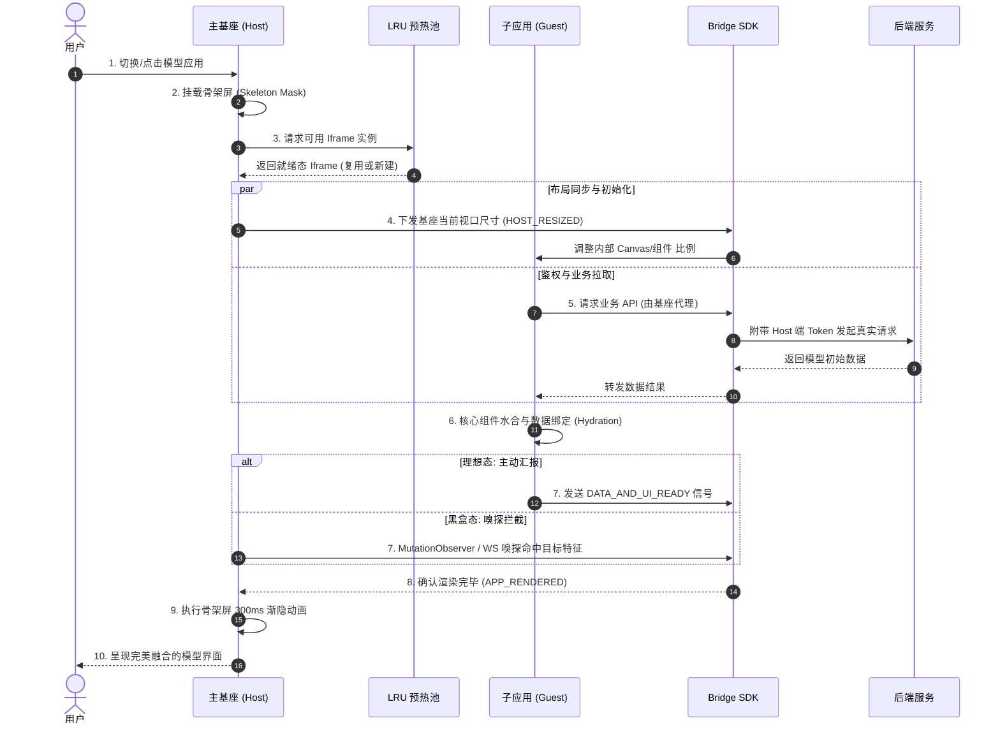

# 软件设计文档 (SDD)：星轨 (Orbit) v2.0 - 异构微前端架构设计

## 1. 概述与背景

随着 AI 业务的爆发，前端控制台需要接入大量由不同算法团队开发的异构模型 Demo（技术栈涵盖 Python Streamlit, Gradio, 原生 WebGL, React 等）。
为了在不魔改异构子应用代码的前提下，实现**物理防爆隔离**、**极速冷启动**与**丝滑的单页级用户体验**，特设计本套纯 `iframe` 架构演进方案——星轨 (Orbit) v2.0。

## 2. 设计目标与核心指标

1. **绝对的物理防爆边界：** 必须隔离 DOM 和 JS 上下文，防止不可信代码导致主基座崩溃，保证 GPU 加速资源（WebGL）的独立运作。
2. **零闪烁无感知加载：** 消灭 `iframe` 传统的白屏和布局抖动，视觉控制权 100% 收归主基座。
3. **极速可用状态：** 模型冷启动从 `> 5秒` 缩短至 `< 1秒`（通过预热池和预加载缓存）。
4. **单点事实与安全穿透：** 鉴权 Token 统一由基座保管，子应用通过高频消息总线或拦截代理获得网络能力，确保权限同步。

## 3. 架构全景蓝图

系统核心由四大引擎支撑：

* **核心 1：通信与控制总线 (Bridge SDK)**
  * **机制：** 弃用原生单向 `postMessage`，封装基于 JSON-RPC 2.0 规范的 Promise 双向异步调用 `IframeBridge`。
  * **能力：** 支持超时熔断；支持“UI越权”（例如子应用通过 Bridge 指挥主基座渲染全局弹窗，突破流式布局限制）。

* **核心 2：无感知预热池 (LRU Iframe Pool)**
  * **机制：** 在非可视区域 (`left: -9999px`) 维护常驻的 `iframe` 节点队列（最大并发量设定为 `maxSize: 3`，基于最近最少使用淘汰原则）。
  * **能力：** 将庞大的前端框架（如 Streamlit）拉起、加载解析 JS、WebSocket 握手的时间耗费转移到用户闲置后台。

* **核心 3：流式布局与响应式防线 (Layout & Resize Guard)**
  * **布局反转：** 坚持基座霸权，使用 `min-height: 0; overflow: hidden;` 死死锁死 iframe 的外层容器边界。
  * **尺寸探针：** 基座侧监听容器 `width` 并高频下发；子应用内部监听内容 `height` 并高频上报。
  * **防崩溃锁：** 引入 `requestAnimationFrame` 配合 `lodash.debounce` 以及 `5px` 变化容差阈值（Threshold），彻底切断可能导致的“容器互相撑开死循环（Infinite Resize Loop）”。

* **核心 4：复合视觉嗅探状态机 (Hybrid Sniffer & Handover)**
  * **白盒应用：** 接收 SDK 抛出的 `APP_RENDERED` 信号。
  * **黑盒应用：** 拦截 Fetch API 或使用 `PerformanceObserver` 监听特定的 WebSocket 握手状态（如 `/_stcore/stream`）。
  * **兜底策略：** 注入 `MutationObserver` 探测核心组件（如 `.gradio-container`）是否挂载。
  * **视觉平滑交接：** 探测成功后，覆盖在 iframe 表层的骨架屏不直接消失，而是执行 `300ms` 的 `opacity` 渐隐。

---

## 4. 核心系统时序图

以下时序描述了用户触发模型切换，直到完美加载展现的全流程。



---

## 5. API 与核心模块接口定义

### 5.1 异步通信 Bridge SDK 定义

基于双向通讯设计的轻量级 RPC。

```typescript
// 通信标准协议
interface BridgeMessage<T = any> {
  id: string;          // 请求/响应 的唯一追踪 ID
  action: string;      // 调用的事件标识，如 'GET_TOKEN'
  payload?: T;         // 数据负载
  isResponse?: boolean;// 用于识别是主动请求还是回调结果
  error?: string;      // 错误透传
}

// 核心类声明
class IframeBridge {
  constructor(targetWindow: Window, targetOrigin: string = '*');
  
  // 拦截 iframe 的原生 postMessage
  private async handleMessage(event: MessageEvent): Promise<void>;
  
  // 主动调用对方能力，并等待对方 return 结果 (支持超时设定)
  public request<T>(action: string, payload?: any, timeoutMs?: number): Promise<T>;
  
  // 注册自身的能力供对方调用
  public on(action: string, handler: (payload: any) => any | Promise<any>): void;
  
  // 发送单向广播 (不等待响应)
  public broadcast(action: string, payload?: any): void;
}
```

### 5.2 LRU 预热池接口定义

```typescript
// 预热池管理类
class IframePoolManager {
  private maxSize: number; // 默认最大为 3
  
  // 静默预加载核心资源
  public preload(url: string): void;
  
  // 获取可用的沙箱实例 (命中池子则直接复用，未命中则新建)
  public getSandbox(url: string): HTMLIFrameElement;
  
  // 手动清理长期不活跃的节点并解绑事件以防内存泄露
  public evictStaleNodes(): void;
}
```

### 5.3 混合视觉嗅探器定义

```typescript
// 混合探测器：当目标页面确信 "就绪" 时触发回调
function watchIframeReady(
  iframeWindow: Window, 
  frameworkType: 'gradio' | 'streamlit' | 'custom',
  onRendered: () => void
): void {
  // 逻辑包含:
  // 1. Bridge 主动通讯拦截
  // 2. PerformanceObserver 监控 WebSocket /api 握手
  // 3. MutationObserver 监听特定 Selector
}
```

## 6. 异常应对机制（降级方案）

| 风险场景 | 影响后果 | 应对降级方案 (Fallback) |
| :--- | :--- | :--- |
| **API/Token 代理请求失败** | 模型彻底不可用，数据接口返回 401 | Bridge 向基座抛出错误，骨架屏停止动画，切换为“全局断网/授权异常”错误页提供重试。 |
| **Gradio/Streamlit DOM 探测全失败** | 骨架屏长久覆盖，死锁白屏 | 嗅探器内部设定 `timeout`（例如 `10s`），无论是否真正成功，到达超时时间强制 `resolve`，渐隐骨架屏，暴露可能仍在加载中的原始 `iframe` 界面作为最后的兜底。 |
| **跨域导致 ResizeObserver 失效** | 内部存在滚动条，布局不优雅 | 通过配置主基座 Nginx 将模型环境挂载在相同的二级域名下（如同源策略 `example.com/models/xxx`），强制变为可操控状态。 |

---

# 附录：交给大模型生成代码的 System Prompts

*使用说明：请将以下 Prompt 分三次发送给 Cursor / Claude / Gemini，让其逐步生成底层核心代码。*

### 模块 1：生成基础设施与通信中枢
> **角色设定**：你是一名具有 10 年架构经验的前端专家。
> **任务**：我需要为一套基于 Iframe 的 AI 模型异构微前端架构编写核心 TypeScript 代码。
> **第一部分需求（通信与预热）**：
> 1. 设计并实现 `IframeBridge` 类。要求：基于 JSON-RPC 2.0 规范封装 `postMessage`，使用 Promise 解决跨 iframe 异步调用，且具备请求超时熔断机制。
> 2. 设计并实现 `IframePoolManager` 类。要求：实现一个基于 LRU 策略的 Iframe 预热池，处理 iframe 的后台静默加载（`visibility: hidden`）、状态重置以及防止内存泄漏的销毁逻辑。
> 3. 提供完整的接口定义 (Interface) 和异常处理逻辑。

### 模块 2：生成响应式布局与防死循环机制
> **角色设定**：你是一名具有 10 年架构经验的前端专家。
> **第二部分需求（流式布局防崩与尺寸同步）**：
> 1. 请在微前端基座中实现 `LayoutSyncObserver`。
> 2. 解决基座与 Iframe 的双向尺寸同步问题：主应用需监听包裹容器将 width 下发给子应用；子应用需监听内部 `document.body` 将 height 上报给基座。
> 3. **致命坑点规避**：必须详细实现“防无限重绘死循环（Infinite Resize Loop）”机制。请在代码中结合 `requestAnimationFrame`、防抖（Debounce）以及 `5px` 容差阈值锁（Threshold lock）来切断事件反弹。
> 4. 提供基座端和子应用端的 CSS 关键骨架样式（Box Model Inversion），确保流式布局下子应用内容不会撑破基座的外层 Flex/Grid 布局。

### 模块 3：生成渲染状态机与视觉交接策略
> **角色设定**：你是一名具有 10 年架构经验的前端专家。
> **第三部分需求（黑盒嗅探与无感知加载 UI）**：
> 1. 请实现一个复合型嗅探器 `HybridRenderSniffer`，用于判断黑盒 Python AI 框架（Streamlit/Gradio）是否真正在 iframe 内部渲染完成数据。
> 2. 嗅探器需包含三层降级策略：Level 1 监听子应用 SDK 的主动汇报；Level 2 监听子应用内部 WebSocket 长连接的握手状态（基于 Performance API）；Level 3 使用 `MutationObserver` 探测特定的核心 DOM 节点。
> 3. 基于 React 或 Vue 3，编写一个 `MicroAppContainer` 组件，整合上述能力。该组件在加载时必须覆盖一个绝对定位的 Skeleton 骨架屏，当收到嗅探器的 Ready 信号后，不立刻销毁 DOM，而是通过 CSS 执行 300ms 的 opacity 渐隐动画，实现视觉的平滑无感知交接。