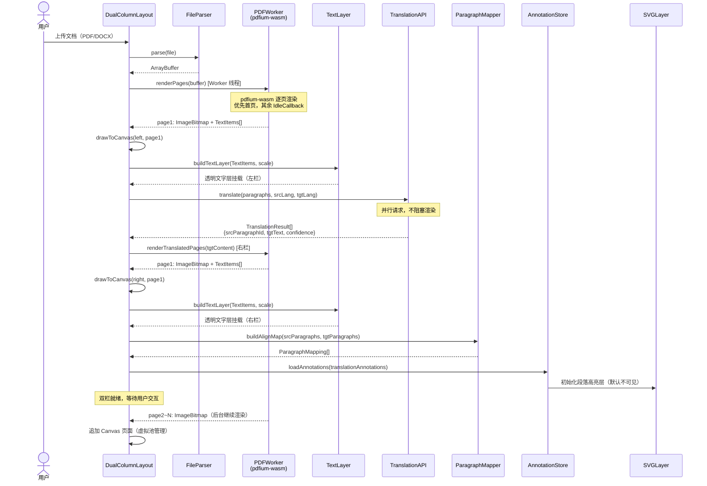
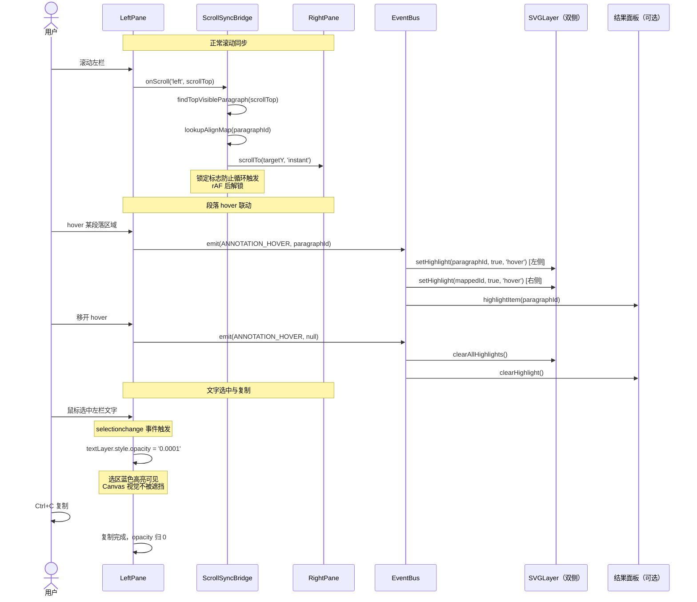
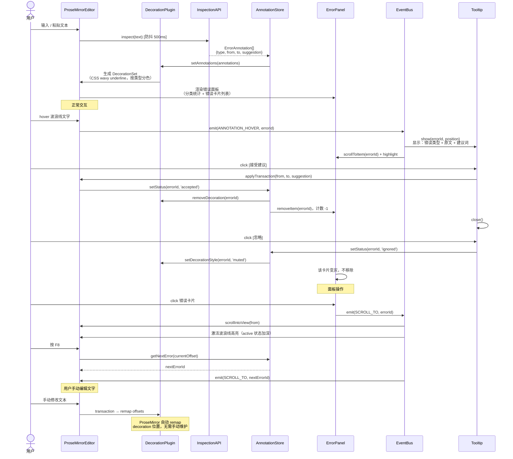
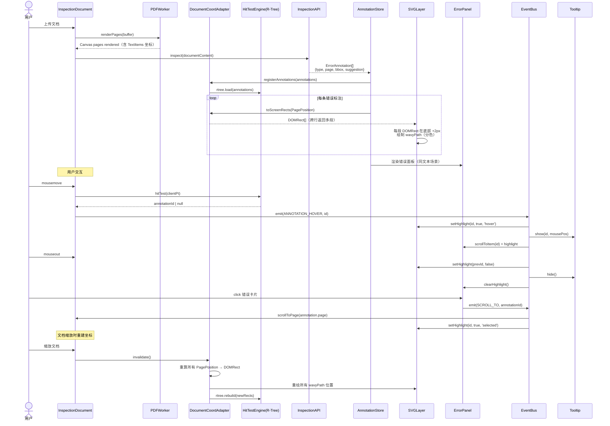
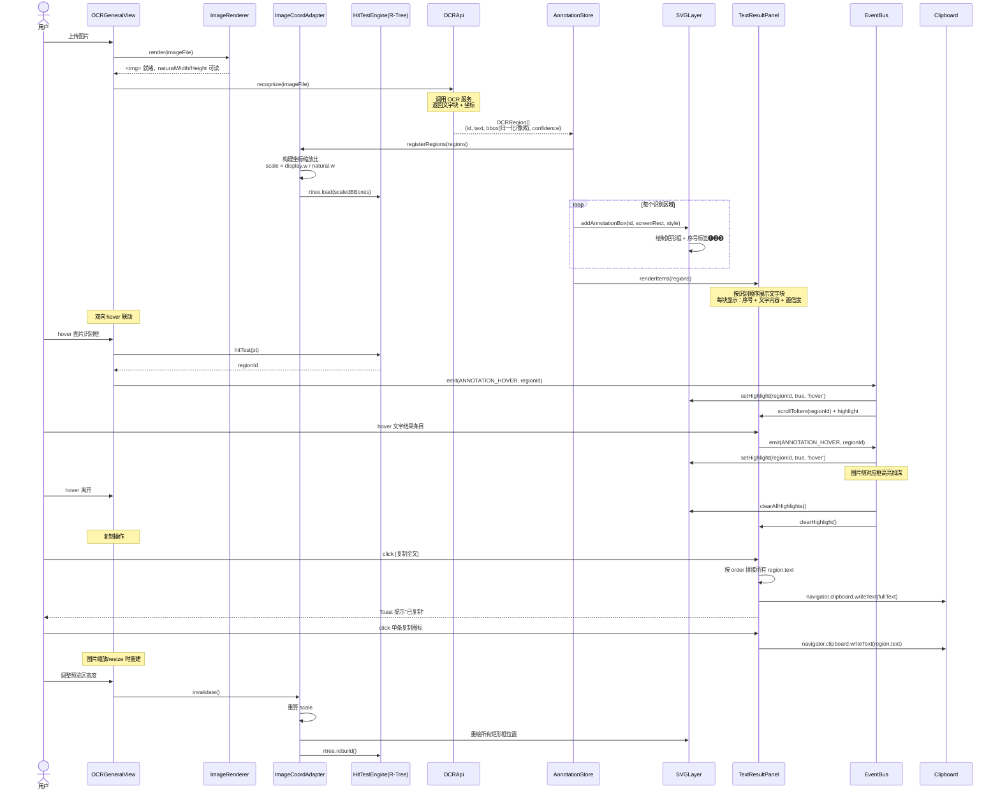
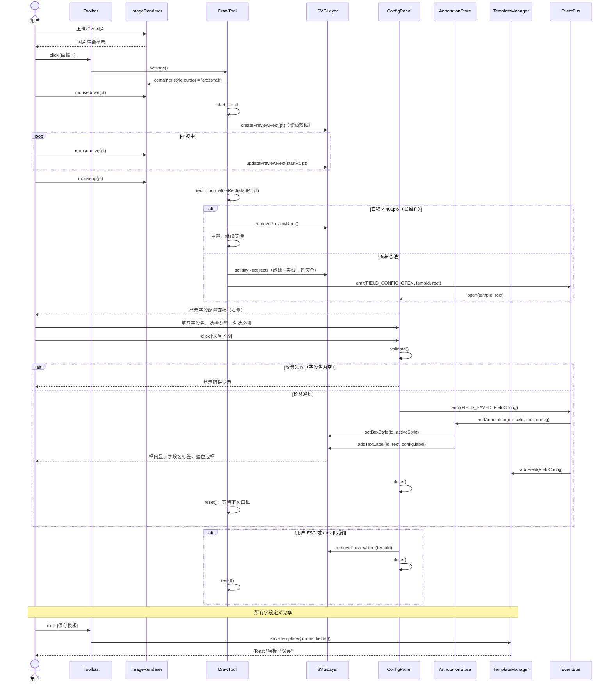
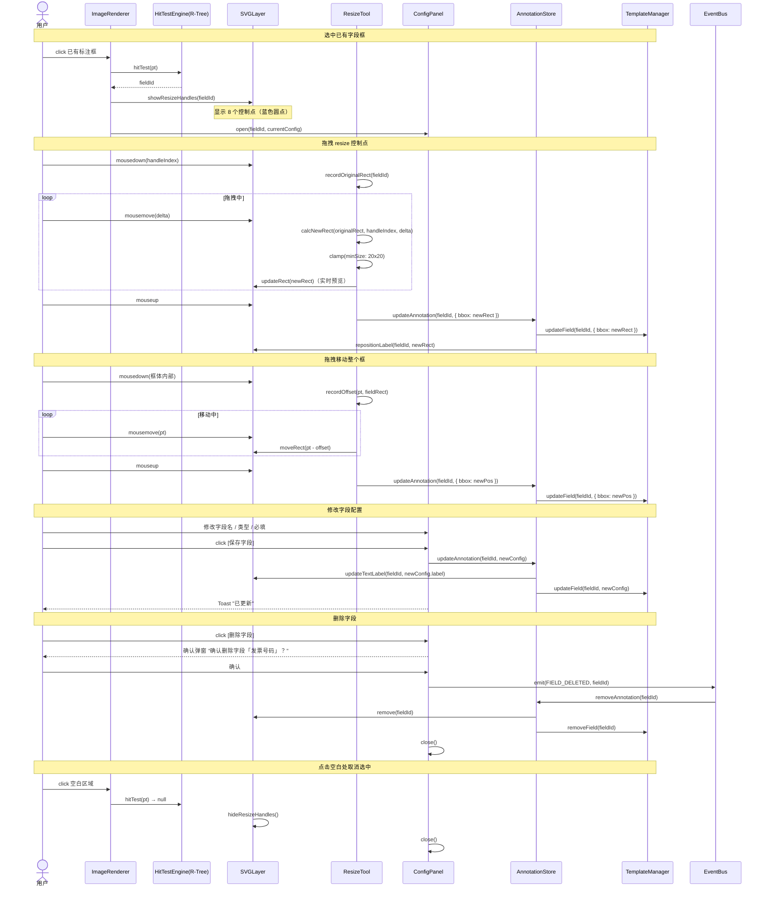
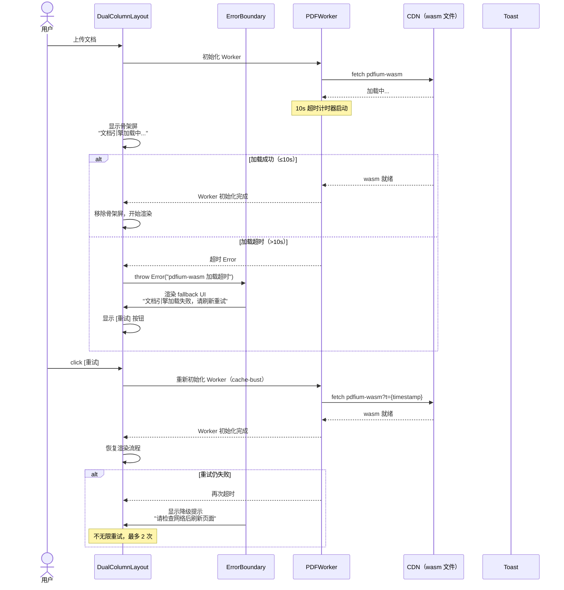
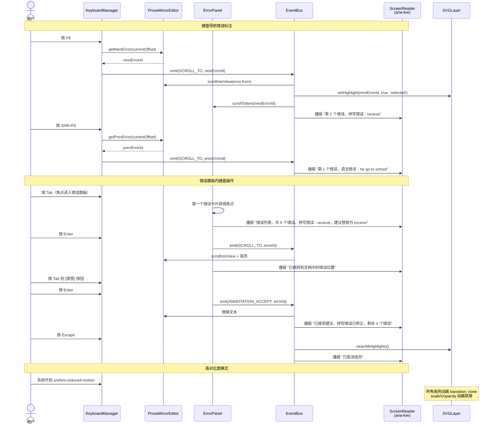

# 多模态 AI 渲染引擎 — 时序图

> 使用 Mermaid 语法，可在 GitHub / VSCode / Obsidian 等工具渲染

---

## 时序图索引

1. [翻译双栏 — 文档加载与渲染](#1-翻译双栏--文档加载与渲染)
2. [翻译双栏 — 滚动同步与段落联动](#2-翻译双栏--滚动同步与段落联动)
3. [智检 — 纯文本场景](#3-智检--纯文本场景)
4. [智检 — 文档场景](#4-智检--文档场景)
5. [OCR 通用 — 图片识别与双向联动](#5-ocr-通用--图片识别与双向联动)
6. [OCR 自定义 — 创建字段模板](#6-ocr-自定义--创建字段模板)
7. [OCR 自定义 — 编辑与删除字段](#7-ocr-自定义--编辑与删除字段)
8. [错误降级 — pdfium-wasm 加载失败与重试](#8-错误降级--pdfium-wasm-加载失败与重试)
9. [智检 — 键盘导航与无障碍交互](#9-智检--键盘导航与无障碍交互)
10. [OCR 通用 — 超时与部分失败处理](#10-ocr-通用--超时与部分失败处理)

---

## 1. 翻译双栏 — 文档加载与渲染



---

## 2. 翻译双栏 — 滚动同步与段落联动



---

## 3. 智检 — 纯文本场景



---

## 4. 智检 — 文档场景



---

## 5. OCR 通用 — 图片识别与双向联动



---

## 6. OCR 自定义 — 创建字段模板



---

## 7. OCR 自定义 — 编辑与删除字段



---

## 附：Actor 说明

| Actor | 说明 |
|-------|------|
| DualColumnLayout | 翻译双栏主容器组件 |
| PDFWorker | pdfium-wasm 运行在 Web Worker 中的渲染器 |
| TextLayer | 透明 DOM 文字层，用于原生文本选择与复制 |
| ScrollSyncBridge | 双栏滚动同步控制器 |
| ParagraphMapper | 原文/译文段落对齐映射构建器 |
| InspectionDocument | 文档智检主视图 |
| DocumentCoordAdapter | 文档场景坐标适配器（页面坐标→屏幕坐标）|
| ImageCoordAdapter | 图片场景坐标适配器（像素坐标→屏幕坐标）|
| HitTestEngine | 基于 R-Tree 的空间索引命中检测引擎 |
| SVGLayer | SVG 标注层工厂（波浪线、矩形框、标签）|
| AnnotationStore | 全局标注数据状态管理 |
| StateMachine | 交互状态机（idle/hover/selected/drawing）|
| EventBus | 跨组件事件总线（双向联动核心）|
| DrawTool | OCR 自定义矩形画框工具 |
| ResizeTool | 矩形控制点缩放/移动工具 |
| ConfigPanel | 字段属性配置面板 |
| TemplateManager | OCR 模板 CRUD 管理器 |
| ErrorPanel | 智检错误列表面板 |
| TextResultPanel | OCR 通用识别文字结果面板 |
| DecorationPlugin | ProseMirror 标注渲染插件 |

---

## 8. 错误降级 — pdfium-wasm 加载失败与重试



---

## 9. 智检 — 键盘导航与无障碍交互



---

## 10. OCR 通用 — 超时与部分失败处理

```mermaid
sequenceDiagram
    actor U as 用户
    participant UI as OCRGeneralView
    participant IM as ImageRenderer
    participant API as OCRApi
    participant AC as AbortController
    participant AS as AnnotationStore
    participant SVG as SVGLayer
    participant TP as TextResultPanel
    participant Toast as Toast

    U->>UI: 上传大图（10MB）
    UI->>IM: render(imageFile)
    IM-->>UI: 图片渲染完成

    UI->>AC: new AbortController()
    UI->>API: recognize(file, { signal: AC.signal })

    Note over API: 20s 超时计时器

    alt 识别成功（≤20s）
        API-->>AS: OCRRegion[]（全部）
        AS->>SVG: 绘制所有识别框
        AS->>TP: 渲染所有文字结果
        Toast-->>U: "识别完成，共 15 个区域"
    else 部分超时（20s 触发）
        API-->>AC: abort()
        AC-->>UI: AbortError

        alt 已有部分结果
            API-->>AS: OCRRegion[]（部分，如 8/15）
            AS->>SVG: 绘制已返回的识别框
            AS->>TP: 渲染已返回的文字结果
            Toast-->>U: "识别超时，仅返回 8/15 个区域 [重试]"
            Note over TP: 未识别区域保留空位<br/>显示虚线占位框
        else 无任何结果
            UI->>UI: 显示错误状态
            Toast-->>U: "识别失败，请检查网络后重试 [重试]"
        end
    end

    alt 用户点击 [重试]
        U->>UI: click [重试]
        UI->>API: recognize(file) [重新请求]
        Note over API: 复用同一 AbortController<br/>超时重置为 20s
    end

    Note over TP: 低置信度处理

    API-->>AS: 部分 region confidence < 0.3
    AS->>TP: 渲染低置信度条目
    Note over TP: 低置信度条目：<br/>opacity: 0.4<br/>⚠️ 图标 + title="识别置信度较低"<br/>全文复制时仍包含

    Note over TP: 图片切换时清理

    U->>UI: 上传新图片
    UI->>AC: abort() 取消上一次请求
    UI->>AS: clear() 清空旧标注
    UI->>SVG: clear() 清空旧识别框
    UI->>IM: 回收旧图片 ImageBitmap
    Note over IM: URL.revokeObjectURL(oldUrl)
    UI->>IM: render(newImageFile)
    Note over UI: 流程重新开始
